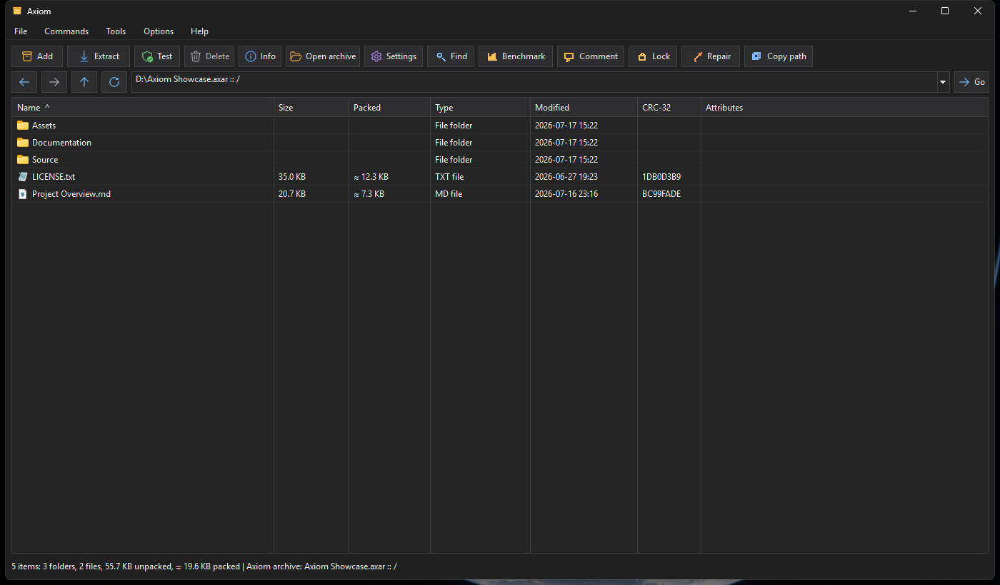
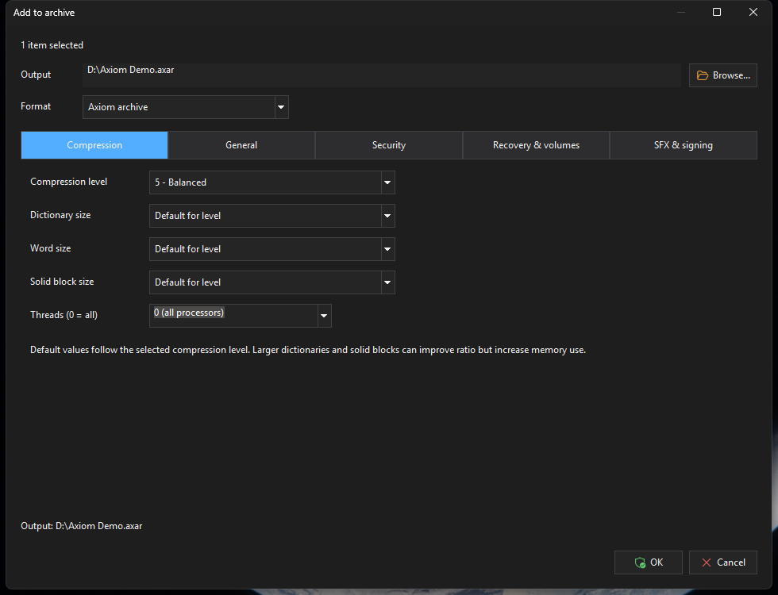
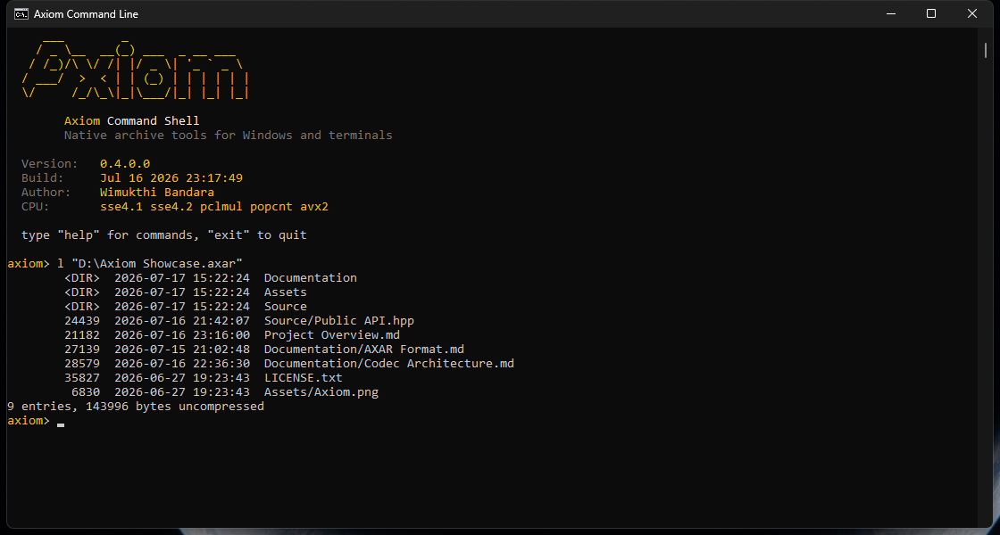

# AxiomCompress

AxiomCompress is an experimental archive compressor for Windows and the command
line. Its main archive format is `.axar`; the lower-level single-stream format is
`.axc`.

The current goal is competitive modern solid compression with a simple, bounded
decoder. Axiom is measured across LZ4, zstd, Deflate, bzip2, LZMA2, and WinRAR
RAR5. On the Silesia
corpus the maximum preset sits between zstd's high-ratio profiles and LZMA2,
while retaining much faster decode than WinRAR, bzip2, and LZMA2 (see the
performance section below). Beyond the codec, the project has a complete
archive container, a native Win32 GUI, a scriptable CLI,
integrity checks, encryption, recovery data, split volumes, signing, and SFX
packaging.

## Screenshots

[](docs/images/axiom-gui.png)

| Add to archive | Interactive command line |
|---|---|
| [](docs/images/axiom-add-to-archive.png) | [](docs/images/axiom-cli.png) |

## Start here

Most users need one of these paths:

| Goal | Use |
|---|---|
| Create/open archives visually | `out\Release\Axiom.exe` |
| Script backups or tests | `out\Release\axiomc.exe` |
| Learn every CLI command | [CLI_GUIDE.md](CLI_GUIDE.md) |
| Understand the archive layout | [FORMAT.md](FORMAT.md) |
| Understand the codec design | [ARCHITECTURE.md](ARCHITECTURE.md) |
| Benchmark speed and ratio changes | [docs/BENCHMARKING.md](docs/BENCHMARKING.md) |
| Build an installer | [docs/INSTALLER.md](docs/INSTALLER.md) |

## What Axiom supports today

- Multi-file `.axar` archives with files, folders, metadata, NTFS alternate data
  streams, symlinks, hardlinks, comments, locking, and archive editing.
- Solid blocks for cross-file compression while keeping each block independently
  decodable for selective extraction.
- Automatic file-type grouping plus reversible x86 branch and PCM/raster delta
  filters. A fast trial keeps a filter only when it predicts a net size win.
- Per-block CRC checks, per-file CRC-32, and per-file BLAKE3-256 hashes.
- Optional password encryption using Monocypher Argon2id and
  XChaCha20-Poly1305.
- Optional encrypted filenames/directories.
- Recovery records, repair, split volumes, and `.rev` recovery volumes.
- Monocypher EdDSA archive signatures.
- Native Windows SFX output for AXAR and ZIP as a single merged `.exe`.
- Cooperative progress, pause, resume, and cancel through shared worker-thread
  operation control.
- Coverage-guided fuzz targets and Release-mode round-trip tests.

## Build

### Visual Studio / MSBuild

Open `AxiomCompress.sln` in Visual Studio and build `Release|x64`.
The checked-in Visual Studio projects target the installed Visual C++ toolset
`v145`.

From PowerShell:

```powershell
& "C:\Program Files\Microsoft Visual Studio\18\Community\MSBuild\Current\Bin\MSBuild.exe" AxiomCompress.sln /p:Configuration=Release /p:Platform=x64
```

Or use the helper scripts:

```powershell
.\tools\build_msvc.ps1 -Configuration Release
.\tools\test_msvc.ps1 -Configuration Release
```

The solution contains:

| Project | Purpose |
|---|---|
| `AxiomLib` | Static library for the archive and codec engine |
| `AxiomC` | CLI executable, `axiomc.exe` |
| `AxiomGui` | Native Win32 GUI executable, `Axiom.exe` |
| `AxiomRoundtrip` | Test executable |

`AxiomGui.vcxproj` uses source-backed versioning like NativePad. Normal GUI
builds increment the fourth version component in `src\gui\axiom_gui.rc`. For a
diagnostic build that must not modify source, pass:

```powershell
.\tools\build_msvc.ps1 -Configuration Release -AutoIncrementVersion:$false
```

Details: [docs/VERSIONING.md](docs/VERSIONING.md).

Packaged releases pin the exact resource version before tagging, then build with
`-AutoIncrementVersion:$false` so the installer, zip asset, About dialog, and
GitHub release tag all use the same four-part version.

### CMake

```powershell
cmake --preset default
cmake --build --preset default
ctest --preset default
```

If Ninja is not installed but Visual Studio 2022 is available:

```powershell
cmake --preset vs2022
cmake --build --preset vs2022 --config Release
```

## GUI

The GUI executable is:

```text
out\Release\Axiom.exe
```

It is a native Visual C++ / Win32 application. It does not use Qt, .NET, WinUI, or
web UI layers.

### Main window

The main window behaves like a file manager:

- Browse filesystem folders and `.axar` archives.
- Open `.zip` archives for browsing, testing, extraction, and normal edit
  operations.
- Use the editable address dropdown for paths, drives, shell locations, recent
  folders, and history.
- Sort and resize columns.
- Select multiple files.
- Drag files from Explorer into an archive.
- Drag files out of an archive to Explorer.
- Move entries between folders inside an archive.
- Open dropped archives directly in the browser.

Archives are presented through a provider/catalog layer. The UI asks the archive
engine what each archive can do, then enables or disables commands from those
capability flags.

That provider layer is internal for now. It is designed so future built-in
providers such as ZIP or TAR can expose view/extract/test/update capabilities
without turning Axiom into an external plug-in host before the API is stable.

Current provider support:

| Format | Browse | Extract | Test | Create/update/delete/move |
|---|---:|---:|---:|---:|
| AXAR | Yes | Yes | Yes | Yes |
| ZIP | Yes | Yes, stored/deflated entries | Yes | Yes, with limits for encrypted ZIPs |
| 7z, RAR, TAR family, ISO, CAB | Yes on Windows | Yes on Windows | Yes on Windows | No |

ZIP create/update/delete/move support rewrites the ZIP atomically through the
archive provider layer and populates the Packed column from the ZIP central
directory. AXAR populates Packed with a proportional estimate because solid
blocks can contain data from several files; estimated values are marked with
`≈`. New encrypted ZIPs use WinZip AES-256 file-data encryption. ZIP file names
remain visible, and existing encrypted ZIPs are read/test/extract only for now.
AXAR-only features such as archive comments, locking, recovery records and recovery
volumes, signatures, encrypted names, and Axiom metadata remain disabled
when ZIP is selected. ZIP can create and open standard `.z01`, `.z02`, ..., `.zip`
split sets; split sets are read-only and must be recreated to change their entries.
SFX packaging works for both AXAR and ZIP and emits only the merged executable.

On Windows, Axiom also exposes read-only archive providers for common formats.
ISO browsing uses Axiom's native ISO9660/Joliet directory reader so large images
display immediately; ISO extraction/test still use the bundled 7-Zip backend.
The bundled 7-Zip backend also handles `.7z`, `.rar`, and `.cab`; Windows
`tar.exe` handles `.tar`, `.tar.gz`, `.tgz`, `.tar.xz`, `.txz`, `.tar.bz2`,
`.tbz2`, `.tar.zst`, and `.tzst`. These formats never appear as Add-to-archive
creation targets.

See [docs/FORMAT_SUPPORT.md](docs/FORMAT_SUPPORT.md) for the planned split
between full read/write formats and view/extract-only formats.

### Archive operations

The GUI supports:

- Add files/folders.
- Extract.
- Test integrity.
- Delete entries.
- Edit archive comments.
- Lock archives.
- Repair damaged archives when recovery data is available.
- Open complete numbered split-volume sets directly; reconstruct only when data
  parts are missing or damaged.
- Sign and verify archives.
- Create native SFX executables.

Long-running operations run on worker threads. The main window remains
responsive, and progress includes byte counts, throughput, ETA, output size, and
compression ratio when available. Pause/resume and cancel use the same
`OperationControl` path as the CLI/library.

### Add to Archive dialog

Archive creation uses one resizable tabbed dialog:

| Tab | Contains |
|---|---|
| Compression | Level, dictionary size, word size, solid block size, threads |
| General | Update mode, archive comment, metadata notes |
| Security | Password, filename encryption, show-password toggle |
| Recovery & volumes | Recovery record, split volume size, recovery volumes |
| SFX & signing | Self-extracting output and archive signing |

The output path and effective-output preview stay visible across tabs. If SFX is
enabled, the final output is the merged `.exe`; Axiom does not leave a separate
archive next to it.

### Dark mode and DPI

The GUI is designed to stay native while still looking correct in dark mode:

- Dark title bars, menus, dialogs, list views, progress controls, combo boxes, and
  custom message boxes.
- Per-monitor DPI-scaled fonts, icons, spacing, and dialog layouts.
- Owner-drawn controls where common controls do not dark-theme correctly.
- Shared command IDs for menus, toolbar buttons, keyboard shortcuts, and context
  actions.

### Settings

Settings are stored per user under:

```text
HKCU\Software\AxiomCompress\GUI
```

The Settings dialog has these pages:

- General
- Compression
- Paths
- File list
- Viewer
- Security
- Integration
- Updates
- Advanced

The Integration page can register per-user file associations for AXAR,
ZIP/JAR/WAR/APK, 7z, RAR, TAR-family, ISO, and CAB files. Read-only formats use
embedded Axiom format icons and open into the browser for viewing, testing, and
extraction.

Settings are wired only where the engine or GUI has real behavior. Unsupported
future options are disabled instead of being stored as silent no-ops.

### Benchmark window

`Tools > Benchmark...` opens a 7-Zip-style benchmark window for measuring Axiom
compression and extraction throughput. It can use generated corpora or a custom
input folder/file. Generated data is created directly in RAM; custom input is
preloaded once before timing. Every compression, decompression, and byte-for-byte
verification pass then runs entirely in memory, so storage throughput and
temporary-file cleanup do not contaminate the codec result.

The default versioned synthetic corpus uses deterministic literals and
log-distributed backward matches to exercise the match finder across the active
window, rather than timing a trivially repeated string. Automatic sizing fits
the selected level and available memory, while each measured phase repeats long
enough to reduce timer noise. Continuous mode runs until **Stop**, retaining
bounded recent-pass details plus lifetime throughput, rolling variation, and a
stability indicator.

## CLI quick start

Use `axiomc.exe` for scripts and automation:

```powershell
axiomc a archive.axar mydir file.txt
axiomc l archive.axar
axiomc t archive.axar
axiomc x archive.axar restored
```

Common archive commands:

```powershell
axiomc a --level 9 archive.axar mydir
axiomc a -p "password" archive.axar private-dir
axiomc a -p "password" --encrypt-names hidden.axar private-dir
axiomc a archive.zip mydir
axiomc a -p "password" encrypted.zip private-dir
axiomc recovery archive.axar 10
axiomc repair archive.axar
axiomc split archive.axar 100M 3
axiomc join archive.part001.axar restored.axar
axiomc keygen secret.key public.key
axiomc sign archive.axar secret.key
axiomc verify archive.axar public.key
axiomc sfx archive.axar archive.exe
```

For `.zip` output, `-p/--password` creates WinZip AES-256 file-data encrypted
entries. ZIP file names remain visible; use `.axar --encrypt-names` when names
and directory metadata must be hidden.

Single-stream `.axc` mode:

```powershell
axiomc c input.bin output.axc
axiomc c --fast input.bin output.axc
axiomc c --max input.bin output.axc
axiomc d output.axc restored.bin
```

Launching `axiomc` without arguments opens an interactive prompt. Full command
reference: [CLI_GUIDE.md](CLI_GUIDE.md).

## Compression levels

One level chooses the speed/ratio tradeoff:

| Level | Matcher / parser | Intended use |
|---|---|---|
| 1 / `--fast` | Fast row hash | Fastest compression |
| 2-3 | Shallow hash chain, price-aware lazy | Fast backups |
| 4-5 | Lazy hash chain, price-aware lazy | Balanced default use |
| 6 | Deeper hash chain | Better ratio without tree memory |
| 7 | Binary tree + cost-aware lazy lookahead, 8 MiB window | Long-range redundancy without optimal-parse cost |
| 8 | Binary tree + single-pass optimal parse, 32 MiB window | Very high ratio at moderate time |
| 9 / `--max` | Deep binary tree + measured-cost optimal parse, 64 MiB window, 4 KiB matches | Maximum preset |

The default is level 5. Levels 8 and 9 run the dynamic-programming optimal
parser with candidates drawn from the binary tree; on generic data they
compress substantially smaller than 6-7.

Levels 2-9 also trial the AXC v6 sequence representation: logarithmic length
codes, recent-distance slots, previous-byte literal lanes, and an optional
rep0-XOR literal residual. AXC v7 adds a hybrid that keeps the older split
command/length/distance representation while applying those stronger literal
lanes. Each block keeps whichever complete representation is smallest.

Across the twelve individual Silesia files, compared with commit `4e014ec7`, the
current level 2 improves aggregate ratio by 2.57% with a 2.67% compression
throughput cost; level 5 improves ratio by 0.81% with a 2.29% throughput cost.
These totals use two complete, SHA-256-verified passes and sum elapsed time across
the corpus rather than averaging unstable per-file percentages.

Advanced flags can override the preset:

```text
--chain-depth N
--nice N
--lazy / --no-lazy
--fast-entropy
--bt
--window SIZE
--block-size SIZE
--threads N
--parallel
--optimal
--optimal-depth N
--optimal-candidates N
```

## Benchmarking

The standard text benchmark is `enwik8`:

```powershell
.\tools\bench_enwik8.ps1
.\tools\bench_enwik8.ps1 -Quick
.\tools\bench_enwik8.ps1 -Axiomc out\Release\axiomc.exe
```

For a round-trip-verified cross-codec comparison on a file or folder:

```powershell
python bench/bench_codecs.py --axiom out/Release/axiomc.exe --input path/to/corpus
python bench/bench_codecs.py --axiom out/Release/axiomc.exe --input path/to/corpus --output results.csv
python bench/bench_codecs.py --axiom out/Release/axiomc.exe --input path/to/corpus --quick
```

The harness auto-detects available LZ4, zstd, 7-Zip, and WinRAR executables and
accepts explicit `--lz4`, `--zstd`, `--sevenzip`, and `--winrar` paths. Every
reported row is decompressed and compared byte-for-byte with the shared input
stream. Verified rows are checkpointed to `--output` as they finish, so a late
external-tool failure does not discard earlier measurements.

`--threads 0` is the default and means all detected hardware threads. Supplying
`--block-size` is useful for controlled experiments, but it disables the default
auto block sizing that keeps enough independent work available for the selected
thread count.

To compare two Axiom builds across compression levels, use the level comparator:

```powershell
.\tools\bench_axiom_levels.ps1 `
  -BaselineAxiomc D:\baselines\axiomc.exe `
  -CurrentAxiomc .\out\Release\axiomc.exe `
  -CorpusDir D:\tests\axiom-perf\corpora `
  -OutputDir D:\tests\axiom-perf\results `
  -Levels 1,2,3,4,5,6,7,8,9 `
  -Repeats 3
```

For a quick smoke test, let the script generate deterministic sample corpora:

```powershell
.\tools\bench_axiom_levels.ps1 `
  -BaselineAxiomc D:\baselines\axiomc.exe `
  -GenerateSampleCorpora `
  -SampleSizeMiB 8
```

The script verifies round-trips and writes raw, summary, and delta CSV files.
Positive compression/decompression deltas mean the current build is faster;
positive ratio deltas mean the current build compressed smaller. For custom
profile sweeps and repeatable tuning workflow details, see
[docs/BENCHMARKING.md](docs/BENCHMARKING.md).

## Performance snapshot

Measured on the **Silesia corpus** (the twelve files packed into one 211.9 MB
uncompressed tar, so every codec sees identical input), AMD Ryzen 9 5950X
(16C/32T), NVMe, warm cache, Release build. Compression is best-of-2 and decode
best-of-3; every row is round-trip verified. Reference tools: zstd 1.5.7
(`-T0`), LZ4 1.10.0, 7-Zip 26.02 (`-mmt=on`) for LZMA2, bzip2, and gzip, and
WinRAR 7.23 RAR5 (`-m3` and `-m5 -md128m`).
Axiom runs with default `--threads 0`. These are direct codec comparisons on
one tar stream; Axiom's results include the default validated-tar member
transforms, just as normal `axiomc c --level N` invocations do.


The SVGs are generated from the versioned CSV snapshots with
`python tools/generate_readme_charts.py`. The exact verified measurements are
retained in
[`bench/results/silesia-0.4.0.0.csv`](bench/results/silesia-0.4.0.0.csv).

| Codec / level | Compressed | Ratio | Compress | Decompress |
|---|---:|---:|---:|---:|
| LZ4 -1 | 100.9 MB | 2.10x | 0.10 s | 0.10 s |
| LZ4 -9 (HC) | 78.0 MB | 2.72x | 0.42 s | 0.10 s |
| zstd -1 | 73.3 MB | 2.89x | 0.08 s | 0.15 s |
| zstd -3 | 66.2 MB | 3.20x | 0.13 s | 0.17 s |
| **Axiom -1** | 64.9 MB | 3.27x | 0.81 s | 0.23 s |
| gzip Deflate -9 | 64.7 MB | 3.28x | 91.35 s | 0.81 s |
| zstd -9 | 59.2 MB | 3.58x | 0.57 s | 0.16 s |
| **Axiom -2** | 59.1 MB | 3.59x | 1.80 s | 0.24 s |
| **Axiom -3** | 58.4 MB | 3.63x | 2.06 s | 0.24 s |
| **Axiom -4** | 56.8 MB | 3.73x | 2.73 s | 0.24 s |
| **Axiom -5** (default) | 56.5 MB | 3.75x | 3.17 s | 0.24 s |
| **Axiom -6** | 56.2 MB | 3.77x | 4.24 s | 0.24 s |
| **Axiom -7** | 54.9 MB | 3.86x | 6.31 s | 0.24 s |
| WinRAR -m3 | 54.2 MB | 3.91x | 2.20 s | 0.51 s |
| bzip2 -9 | 54.2 MB | 3.91x | 7.50 s | 2.17 s |
| WinRAR -m5 128M | 53.2 MB | 3.99x | 3.54 s | 0.50 s |
| zstd -19 | 52.8 MB | 4.01x | 20.38 s | 0.18 s |
| **Axiom -8** | 52.4 MB | 4.04x | 14.38 s | 0.26 s |
| zstd -22 --ultra | 52.3 MB | 4.05x | 98.93 s | 0.19 s |
| **Axiom -9** | 51.4 MB | 4.12x | 21.31 s | 0.24 s |
| LZMA2 -mx5 | 49.6 MB | 4.27x | 19.84 s | 0.81 s |
| LZMA2 -mx9 | 48.7 MB | 4.35x | 40.03 s | 1.26 s |

Reading the table: Axiom's fast presets trade zstd's throughput for a smaller
result, while levels 2–7 cover the range between zstd -3 and WinRAR normal.
Axiom -9 is 2.8% smaller than zstd -19 at similar compression time, and 1.7%
smaller than zstd -22 while encoding 4.6 times faster. WinRAR best is 3.3%
larger and encodes 6.0 times faster, while Axiom decodes 2.1 times faster.
LZMA2 -mx9 is 5.5% smaller than Axiom -9, but Axiom encodes 1.9 times faster
and decodes 5.3 times faster.
These cross-codec tradeoffs define the active ratio, speed, and decoder-complexity
work rather than treating any single comparison as the target.

The same 22-profile protocol was also run on `enwik8` (100 MB English Wikipedia
text, default `--threads 0`):


Exact measurements are retained in
[`bench/results/enwik8-0.4.0.0.csv`](bench/results/enwik8-0.4.0.0.csv).

| Axiom level | Compressed | Ratio | Compress | Decompress |
|---|---:|---:|---:|---:|
| 1 | 37.3 MB | 2.68x | 0.35 s | 0.11 s |
| 2 | 32.8 MB | 3.05x | 0.91 s | 0.10 s |
| 3 | 32.4 MB | 3.09x | 1.18 s | 0.10 s |
| 4 | 32.1 MB | 3.12x | 2.04 s | 0.10 s |
| 5 (default) | 31.8 MB | 3.14x | 2.54 s | 0.10 s |
| 6 | 31.7 MB | 3.15x | 3.42 s | 0.10 s |
| 7 | 30.7 MB | 3.25x | 2.96 s | 0.11 s |
| 8 | 28.7 MB | 3.48x | 6.82 s | 0.10 s |
| 9 | 28.5 MB | 3.51x | 7.05 s | 0.10 s |

The separate full-window diagnostic reaches 3.57x but only 1.9 MB/s, so it is
not promoted to a preset; its complete level/window sweep is retained in
[`bench/results/enwik8-level-window-0.4.0.0.csv`](bench/results/enwik8-level-window-0.4.0.0.csv).
On enwik8, Axiom -9 encodes 5.8 times faster and
decodes 6.5 times faster than LZMA2 -mx9, while LZMA2 remains 12.9% smaller.

Throughput depends on CPU, memory bandwidth, storage, corpus shape, and Release
build settings; re-run `tools\bench_enwik8.ps1` or the method in
[docs/BENCHMARKING.md](docs/BENCHMARKING.md) on your own hardware.

## Testing and fuzzing

Run the Release tests:

```powershell
.\tools\test_msvc.ps1 -Configuration Release
```

Or with CMake:

```powershell
ctest --preset default
```

Build and run fuzz targets:

```powershell
.\tools\build_fuzz.ps1 -Target all
.\tools\run_fuzz.ps1 -Seconds 60 -Target all
```

CI builds and tests on Windows and Linux, then runs both fuzz targets on every
push.

## Packaging

Axiom uses Inno Setup 6 for release installers:

```powershell
.\installer\build-installer.ps1
```

The script builds Release x64, runs the Release round-trip test, reads the app
version from `src\gui\axiom_gui.rc`, and writes:

```text
installer\output\AxiomSetup-<version>-win-x64.exe
```

GitHub releases also carry a portable zip asset named
`Axiom-<version>-win-x64.zip` containing `Axiom.exe`, `axiomc.exe`, the bundled
read-only archive backend, the license, and the user/developer docs.

Details: [docs/INSTALLER.md](docs/INSTALLER.md).

## License

AxiomCompress is licensed under the GNU General Public License version 3. See
[LICENSE](LICENSE).

Vendored third-party components keep their license notices under
`src/third_party`, `third_party`, and the installed `backends` folder. Current
third-party components include:

- miniz 3.1.1 for ZIP read/write support, under the MIT license.
- minizip-ng 4.2.2 container/split-stream core, privately namespaced for
  standard split-ZIP support, under the zlib license.
- 7-Zip console backend for read-only 7z/RAR/ISO/CAB support, under LGPL/BSD
  terms with the upstream unRAR restriction for some RAR code.
- Monocypher for cryptographic primitives, under the BSD 2-Clause license.
- BLAKE3 for hashing and integrity primitives, under CC0/Apache-2.0 licensing.
- A generated subset of Microsoft Fluent UI System Icons for the native GUI,
  under the MIT license.
