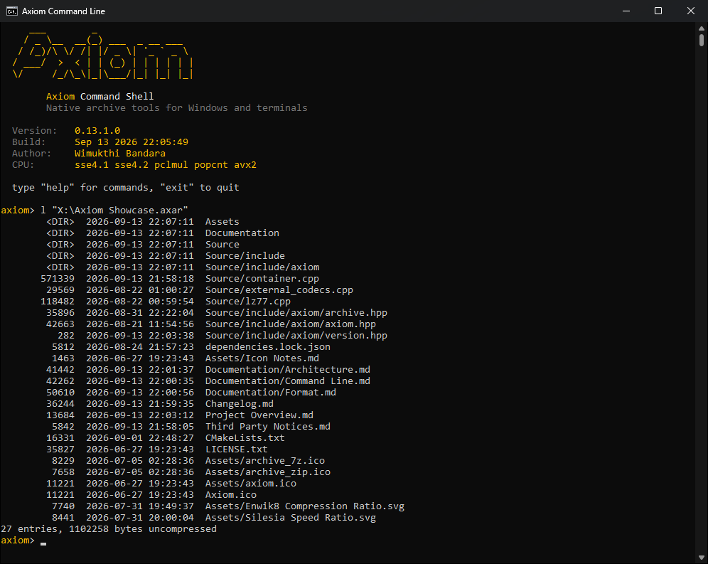

# AxiomCompress

[](https://github.com/Wimukthi/AxiomCompress/actions/workflows/ci.yml)
[](https://github.com/Wimukthi/AxiomCompress/releases/latest)
[](LICENSE)
[](#installation)

An experimental archiver for Windows, built around a compressor that spends CPU
on the encoder so the decoder can stay small, bounded, and fast.

Axiom ships a native Win32 archive manager, a scriptable command-line tool, and
its own container format (`.axar`) with encryption, recovery records, split
volumes, signatures, and self-extracting output. The single-stream format is
`.axc`.

> **Status: pre-release.** The archive format is still free to change between
> minor versions. Keep independent backups of anything you care about.


| Add to archive | Command line |
|---|---|
| [](docs/images/axiom-add-to-archive.png) | [](docs/images/axiom-cli.png) |

## Highlights

- **Solid compression with selective extraction.** Files are grouped into solid
  blocks for cross-file redundancy, but every block stays independently
  decodable, so extracting one file never decodes the whole archive.
- **Five block methods.** Axiom adaptive (default), Zstandard, LZMA2, Deflate,
  and Store. Container features are identical whichever you pick.
- **Fast, bounded decode.** Decompression does no searching, runs no adaptive
  model, and takes its memory ceiling from the block header. Decode time is
  roughly flat across compression levels.
- **Integrity by default.** Per-block CRC-32, per-file CRC-32, and per-file
  BLAKE3-256, all verified by `test`.
- **Optional protection.** Argon2id + XChaCha20-Poly1305 encryption (with
  optional encrypted filenames), Reed-Solomon recovery records, `.rev` recovery
  volumes, and EdDSA signatures.
- **Reads what you already have.** ZIP read/write, plus read-only 7z, RAR,
  ISO/UDF, CAB, and the TAR family on Windows.
- **Native UI.** Direct Win32 — no Qt, .NET, WinUI, or embedded browser — with
  dark mode and per-monitor DPI support.

## Installation

Download the latest [release](https://github.com/Wimukthi/AxiomCompress/releases/latest):

| Asset | Use |
|---|---|
| `AxiomSetup-<version>-win-x64.exe` | Inno Setup installer, with Start Menu entry and App Paths registration |
| `Axiom-<version>-win-x64.zip` | Portable; unzip and run |

Keep `AxiomSfx.bin` and the `backends\` folder beside `Axiom.exe` and
`axiomc.exe`. `AxiomSfx.bin` is the SFX runtime and is not a launchable
program; `backends\7zip\` provides read-only 7z/RAR/ISO/CAB support.

To build from source instead, see [Building](#building).

## Quick start

### GUI

Run `Axiom.exe`. The main window browses folders and archives like a file
manager: open an archive, drag files in or out, and use the toolbar or the
`Archive` menu for add, extract, test, delete, repair, sign, and SFX.

Full walkthrough: [docs/GUI_GUIDE.md](docs/GUI_GUIDE.md).

### Command line

```powershell
axiomc a archive.axar mydir file.txt   # create or add
axiomc l archive.axar                  # list
axiomc t archive.axar                  # test integrity
axiomc x archive.axar restored         # extract
```

Some common variations:

```powershell
axiomc a --level 9 archive.axar mydir
axiomc a --method lzma2 --codec-level 7 archive.axar mydir
axiomc a -p "correct horse battery staple" --encrypt-names private.axar secrets
axiomc a --recovery 10 backup.axar "D:\Work"
axiomc sfx archive.axar installer.exe
```

Running `axiomc` with no arguments opens an interactive shell. Full reference:
[CLI_GUIDE.md](CLI_GUIDE.md).

## Compression levels

One `--level 1..9` knob picks the speed/ratio operating point. The default is
5; `--fast` is 1 and `--max` is 9. The decoder is identical at every level.

| Level | Matcher and parser | Intended use |
|---:|---|---|
| 1 | Fixed-probe row hash | Fastest; minimum CPU |
| 2–3 | Shallow hash chain, price-aware lazy | Fast backups |
| 4–5 | Balanced hash chain, price-aware lazy | General use (default) |
| 6 | Deep hash chain | Better ratio, no tree memory |
| 7 | Binary tree + cost-aware lazy lookahead, 8 MiB window | Long-range redundancy without optimal-parse cost |
| 8 | Binary tree + single-pass optimal parse, 32 MiB window | High ratio at moderate cost |
| 9 | Deep binary tree + measured-cost optimal parse, 64 MiB window | Maximum ratio |

Levels 8 and 9 run a dynamic-programming optimal parser fed by the binary tree.
Individual flags (`--chain-depth`, `--nice`, `--bt`, `--window`, `--optimal…`)
override the preset — a level is only a starting point.

## Performance

Measured on the **Silesia corpus** as a single 211.9 MB tar, so every codec sees
identical input. AMD Ryzen 9 5950X (16C/32T), warm cache, Release build, every
row round-trip verified.

> These figures are the **0.4.0.0** measurement snapshot. Later releases changed
> presets and added methods; the numbers have not been re-measured since.

| Codec / level | Compressed | Ratio | Compress | Decompress |
|---|---:|---:|---:|---:|
| zstd -3 | 66.2 MB | 3.20x | 0.13 s | 0.17 s |
| **Axiom -5** (default) | 56.5 MB | 3.75x | 3.17 s | 0.24 s |
| WinRAR -m5 128M | 53.2 MB | 3.99x | 3.54 s | 0.50 s |
| zstd -19 | 52.8 MB | 4.01x | 20.38 s | 0.18 s |
| **Axiom -9** | 51.4 MB | 4.12x | 21.31 s | 0.24 s |
| LZMA2 -mx9 | 48.7 MB | 4.35x | 40.03 s | 1.26 s |

Axiom -9 lands between zstd's high-ratio profiles and LZMA2: 2.8% smaller than
zstd -19 at similar encode time, and 5.5% larger than LZMA2 -mx9 while encoding
1.9x and decoding 5.3x faster.

Complete tables, charts, and the enwik8 results: [docs/PERFORMANCE.md](docs/PERFORMANCE.md).
To measure on your own hardware: [docs/BENCHMARKING.md](docs/BENCHMARKING.md).

## Format support

| Format | Browse | Extract | Test | Create / edit |
|---|:--:|:--:|:--:|---|
| AXAR | ✓ | ✓ | ✓ | Full |
| ZIP | ✓ | ✓ | ✓ | Full for plaintext; AES-256 creation |
| 7z, RAR, ISO, CAB | Windows | Windows | Windows | — |
| TAR family | Windows | Windows | Windows | — |

AXAR and ZIP are the only creation targets. Read-only formats use the bundled
`7z.dll` engine and Windows `tar.exe`. Details and roadmap:
[docs/FORMAT_SUPPORT.md](docs/FORMAT_SUPPORT.md).

## Building

Requires a C++20 compiler. Windows builds also need the sibling
[`Wimukthi.Win32Theme`](https://github.com/Wimukthi/Wimukthi.Win32Theme)
checkout beside `AxiomCompress`, or a path passed explicitly.

### Visual Studio / MSBuild

```powershell
.\tools\build_msvc.ps1 -Configuration Release
.\tools\test_msvc.ps1  -Configuration Release
```

Add `-ThemeRoot <path>` if the theme framework is not in the sibling directory.
Binaries land in `out\Release\`.

Normal GUI builds increment the fourth version component in
`src\gui\axiom_gui.rc`. For a build that leaves the working tree untouched:

```powershell
.\tools\build_msvc.ps1 -Configuration Release -AutoIncrementVersion:$false
```

### CMake

```powershell
cmake --preset default
cmake --build --preset default
ctest --preset default
```

Use `--preset vs2022` if Ninja is unavailable, and
`-DWIMUKTHI_WIN32_THEME_ROOT=<path>` to relocate the theme dependency.
Non-Windows builds produce the library, CLI, and tests only.

### Targets

| Target | Output | Purpose |
|---|---|---|
| `AxiomLib` / `axiom` | `axiom.lib` | Archive and codec engine |
| `AxiomC` / `axiomc` | `axiomc.exe` | Command-line tool |
| `AxiomGui` / `axiom_gui` | `Axiom.exe` | Win32 archive manager |
| `AxiomSfx` / `axiom_sfx_module` | `AxiomSfx.bin` | Read-only SFX runtime |
| `AxiomRoundtrip` / `axiom_roundtrip` | `axiom_roundtrip.exe` | Test suite |

## Testing

```powershell
.\tools\test_msvc.ps1 -Configuration Release   # or: ctest --preset default
.\tools\build_fuzz.ps1 -Target all
.\tools\run_fuzz.ps1 -Seconds 60 -Target all
```

The round-trip suite covers the codec, container, safety rules, and an
in-process mutation fuzzer. CI builds and tests on Windows, Linux, and macOS,
and runs both decode-surface fuzz targets on Linux and Windows for every push;
the scheduled run uses longer fuzz durations.

## Documentation

| Document | Contents |
|---|---|
| [CLI_GUIDE.md](CLI_GUIDE.md) | Every `axiomc` command and option |
| [docs/GUI_GUIDE.md](docs/GUI_GUIDE.md) | The Windows archive manager |
| [ARCHITECTURE.md](ARCHITECTURE.md) | Codec and container design |
| [FORMAT.md](FORMAT.md) | `.axar` / `.axc` binary specification |
| [docs/FORMAT_SUPPORT.md](docs/FORMAT_SUPPORT.md) | Per-format capability matrix and roadmap |
| [docs/PERFORMANCE.md](docs/PERFORMANCE.md) | Published benchmark results |
| [docs/BENCHMARKING.md](docs/BENCHMARKING.md) | How to measure changes |
| [docs/INSTALLER.md](docs/INSTALLER.md) | Release packaging |
| [docs/VERSIONING.md](docs/VERSIONING.md) | Version scheme and release steps |
| [docs/GAP_ANALYSIS_LZMA2.md](docs/GAP_ANALYSIS_LZMA2.md) | Research log for the LZMA2 ratio gap |
| [CHANGELOG.md](CHANGELOG.md) | Release history |

## License

AxiomCompress is licensed under the [GNU General Public License v3](LICENSE).
Bundled components keep their own licenses; see
[THIRD_PARTY_NOTICES.md](THIRD_PARTY_NOTICES.md).
