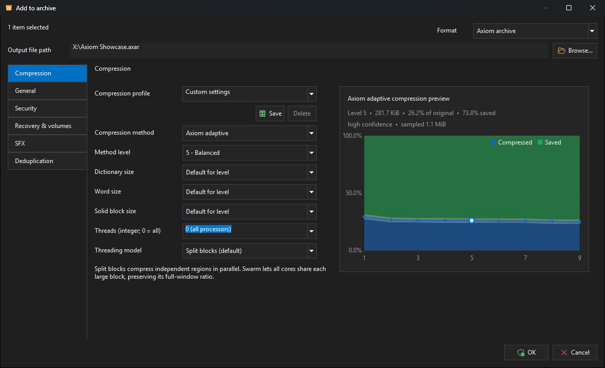

# Using Axiom for Windows

`Axiom.exe` is the Windows app. It browses folders and archives in one window,
and it runs the same engine as the [command-line tool](../CLI_GUIDE.md), so
anything you do here you can also script later.

It is written directly against Win32 — no Qt, .NET, WinUI, or embedded
browser — which is why it starts instantly and why it themes itself the way
Windows does.

New to the terminology? [GLOSSARY.md](GLOSSARY.md) explains the words in plain
language.


## Contents

- [The main window](#the-main-window)
- [Creating an archive](#creating-an-archive)
- [Getting files back out](#getting-files-back-out)
- [Checking and repairing an archive](#checking-and-repairing-an-archive)
- [Protecting an archive](#protecting-an-archive)
- [Making a self-extracting .exe](#making-a-self-extracting-exe)
- [Keeping an archive up to date](#keeping-an-archive-up-to-date)
- [Settings](#settings)
- [Measuring speed on your machine](#measuring-speed-on-your-machine)
- [Keyboard shortcuts](#keyboard-shortcuts)
- [Starting Axiom from a command or from Explorer](#starting-axiom-from-a-command-or-from-explorer)
- [Housekeeping](#housekeeping)

## The main window

The window works like a file manager. The same list shows folders on your disk
and the contents of an open archive, so moving between the two feels the same.

You can:

- Open `.axar` and `.zip` archives to browse, test, extract, and edit them.
  Open 7z, RAR, ISO, CAB, and TAR-family archives to browse, test, and extract
  only — Axiom will not modify those.
- Type or pick a location in the address bar. It accepts paths, drives, shell
  locations such as Documents, your favorites, recent folders, and history.
- Sort by any column, and show, hide, resize, or reorder columns. Your layout
  is remembered.
- Narrow the current list as you type in the instant filter. This works the
  same way in a filesystem folder and inside an archive.
- Copy and paste files, rename one item, or create a folder with the familiar
  Windows shortcuts. In editable AXAR and ZIP archives these commands update
  the archive transactionally.
- Drag files in from Explorer to add them, drag entries out to extract them,
  and drag entries between folders inside an archive to move them.
- Drop an archive file onto the window to open it.

The status bar along the bottom shows what you have selected, the unpacked and
packed totals, and which archive is open.

### The menus

| Menu | What's in it |
|---|---|
| File | Open, compress or decompress a single file, Information, Exit |
| Edit | Copy, Paste, Rename, New folder, Select all, Find, Delete, copy path, copy CRC-32 |
| Archive | Add, Extract, Test, create/add snapshots, Snapshot timeline, Update, Freshen, Synchronize, Repack, Split, Join, comment, lock, recovery, repair, sign, verify, SFX |
| View | Navigation, refresh, tree pane, favorites, column layout |
| Tools | Benchmark, Generate signing key, Delete Axiom temporary files, Settings |
| Help | Check for updates, About Axiom |

The toolbar shows the commands you use most. Which buttons appear, their order,
and whether they show labels or just icons are all set on the **Toolbar** page
in Settings.

### Why some sizes have a ≈ in front of them

A ZIP file records exactly how many bytes each entry takes, so Axiom shows the
real number.

An AXAR archive compresses groups of files together in a *solid block*, which
is what makes it smaller — but it also means there is no honest per-file
answer, because the files share their compressed bytes. Axiom shows a
proportional estimate and marks it with `≈` so you know it is one.

The archive's overall size and ratio are always exact.

### Filtering the current list

Start typing while the file list is active and a compact filter popup appears.
It updates immediately without rereading the folder or archive and reports the
live match count. The popup stays out of the normal window layout when it is
not needed. Press `Ctrl+Shift+F` to open it directly, `Enter` or `Down` to
select the first match, or `Escape` to clear and close it.

Plain words search names, types, and paths. You can combine as many terms as
you need; every positive term must match, and a term beginning with `-` is
excluded. Quotes keep a phrase together. Useful examples:

| Filter | Result |
|---|---|
| `invoice` | Names, types, or paths containing “invoice” |
| `*.jpg -draft` | JPEG names that do not contain “draft” |
| `type:archive` | Archives only |
| `ext:cpp size:>1MB` | C++ files larger than 1 MiB |
| `date:>=2026-01-01` | Items modified on or after that date |
| `name:"quarterly report"` | Exact phrase within the name |

The status bar reports how many visible items remain out of the complete
location. Deep **Find files** is still available with `Ctrl+F`; it searches
beyond the current list and clears the instant filter when you open a result.

### Everyday file operations

`Ctrl+C` and `Ctrl+V`, `F2`, and `Ctrl+Shift+N` provide Copy, Paste, Rename,
and New folder. Filesystem operations go through the Windows shell, including
its collision and elevation handling. Copying from an archive first extracts
the selected roots to Axiom's managed temporary area, then publishes a normal
Windows file list, so it can be pasted into Explorer or another application.

Inside an editable AXAR or ZIP, Paste and New folder add entries, while Rename
moves the selected archive path without recompressing more than the format
requires. Locked archives, filename-encrypted archives, split archives that
cannot be edited, and read-only formats keep these commands disabled.

## Creating an archive

Select the files and folders you want, then press **Add** on the toolbar, or
`Ctrl+N`, or right-click them in Explorer and use the Axiom submenu.

The current filesystem selection can contain files, folders, or both. Folders
are included recursively. If there is no longer a live selection, or if you are
adding entries to an open archive, Axiom asks whether you want to choose a
folder or one or more files.



Everything lives in one resizable dialog. What you selected, the format, and
the output path stay pinned at the top while the rest scrolls. The six option
pages are listed down the left side:

| Page | What you set there |
|---|---|
| Compression | Method, level, dictionary and word size, solid block size, threads, threading model |
| General | Update mode, archive comment, metadata notes |
| Security | Password, filename encryption, show-password toggle, archive signing |
| Recovery & volumes | Recovery record percentage, split volume size, recovery volumes |
| SFX | Whether to produce a self-extracting `.exe`, and what it does when run |
| Deduplication | Live content deduplication and its minimum, average, and maximum chunk sizes |

If you change nothing at all, you get an AXAR archive at level 5 using Axiom's
own method — a reasonable default for almost anything.

### Choosing a method and level

For AXAR, the **Compression method** list offers Axiom adaptive, Zstandard,
LZMA2, Deflate, and Store. Picking one rebuilds the level list and greys out
the controls that don't apply to it, so you never set something that will be
ignored: Axiom exposes its threading model, LZMA2 exposes dictionary and word
size plus its HC4/BT4 match finder, and Zstandard and Deflate keep their own
native level numbers.

ZIP archives can only use Deflate or Store. That's a deliberate limit — those
are what every other tool can read.

The dictionary controls for Axiom and LZMA2 go up to 4 GiB. Choosing 4 GiB
gives you the largest value the file format can hold, which is one byte short
of 4 GiB.

For LZMA2 only, solid block sizes from 8 GiB to 64 GiB switch on a disk-staged
mode: the raw data goes to a temporary file and is compressed in bounded
pieces, so a huge block doesn't need a huge amount of memory. The dialog will
not let you combine that mode with encryption or recovery records.

### Watching the size before you commit

For AXAR and ZIP, the right-hand side of the Compression page predicts the
result at every level the chosen method supports, while you are still deciding.

Blue is the predicted compressed size, green is the predicted saving, and the
pale band around them is how uncertain the estimate still is. Click any point
to select that level.

All the points come from the same sampled regions of your files, so the curve
compares *levels* rather than comparing different parts of your data. Changing
something that affects which bytes are read cancels the estimate and restarts
it after a short pause; changing only the level just moves the marker.

The preview keeps sampling until every visible level is confident, or until it
hits its own time and sample limits. If the limits win, it says the confidence
is bounded rather than presenting a guess as a fact.

### Profiles

Five built-in profiles cover text and source code, executables, structured
data, already-compressed media, and mixed folders. They use level 7 for text,
structured data, and binaries; level 1 for pre-compressed media, where the
point is to give up quickly rather than waste CPU; and level 5 for mixed
folders.

Levels 8 and 9 are deliberately not hidden inside a profile. If you want to
spend that much time, say so.

Saving your own profile keeps the method, native codec level, LZMA2 match
finder, dictionary and word size, solid block size, thread count, and threading
model.

### Deduplicating repeated content

On the **Deduplication** page, switch on **Store repeated file content once**
to create an AXAR whose files share repeated and unchanged regions. This is
useful for source trees, virtual-machine images, and rolling backups where a
small edit would otherwise make another large copy.

The default 256 KiB minimum, 1 MiB average, and 4 MiB maximum chunk sizes suit
general backups. Smaller chunks can discover more overlap at the cost of more
directory records. The three values must stay in order and within 4 KiB through
64 MiB.

Deduplication is selected only when creating a new AXAR. When you later use
Add, Update, Freshen, Synchronize, Delete, Move, or Repack, Axiom detects the
archive's stored profile and preserves its original chunk geometry. Open
**Information** to see whether **Live content deduplication** is active.

### What Axiom records about your files

For AXAR archives this happens automatically: file attributes and timestamps,
sparse file layout, NTFS alternate data streams, and supported security or
extended attributes are all captured when the source allows it.

If some item couldn't be read, or a piece of metadata couldn't be captured, the
result dialog lists the affected paths and explains what was lost. The
operation still counts as successful when the loss was best-effort. If losing
metadata should instead fail the whole operation, use the CLI's
`--strict-metadata` option.

## Getting files back out

Select what you want and press **Extract**, or `Ctrl+E`. Selecting a folder
takes everything inside it. You can also just drag entries out of the window
into Explorer.

In a filesystem folder, select two or more archives and choose **Extract** to
run a batch. Pick one destination root and Axiom creates one subfolder per
archive (`Photos`, `Photos (2)`, and so on when names collide). The progress bar
covers the complete batch. Without **Overwrite** enabled, an existing target
folder stops the batch before any archive is extracted. Selecting several
members of the same recognized split-volume set counts as one archive, so the
set is never extracted repeatedly.

Dragging out happens in two steps, and both report progress. Axiom first
unpacks what you dragged into a temporary folder, then Windows copies it to
where you dropped it. You get a progress window for each, and Cancel works in
both.

Long operations run on background threads, so the window stays usable.

The progress window shows the stage, overall and per-file bars, the current
speed and time remaining, and the item being worked on. Where they apply, it
also shows the compressed size and ratio so far, and how much data was reused
rather than recompressed. Optional summaries stay in place once reported,
including while an operation changes stages.

When an operation runs in several stages, the overall bar covers the whole
thing, while the speed and time remaining describe the stage you're in. The
window says which is which.

Pause, resume, and cancel all work, and cancelling never leaves a half-written
file behind.

When you extract a few files from a large AXAR archive, Axiom reads only the
compressed pieces those files actually need, provided the archive records where
its pieces begin. Older archives, and blocks that are encrypted or filtered,
fall back to reading the whole block — nothing to configure, it just happens.

If an archive was split into numbered volumes and you still have all the data
parts, open any one of them and Axiom reads the set directly. You only need to
rejoin it when a part is missing or damaged.

## Checking and repairing an archive

**Test** (`Ctrl+T`) decompresses everything and verifies every checksum without
writing any files. It is the right thing to run after making a backup and
before deleting the previous one.

If a test reports damage and the archive has a recovery record, **Repair**
(`Ctrl+Shift+P`) rebuilds the damaged parts. A recovery record can only absorb
so much: it is protection against a few bad sectors, not against a failed
drive. Keep a second copy elsewhere.

Add or change a recovery record from the **Archive** menu, or on the
**Recovery & volumes** page when you create the archive.

## Protecting an archive

The **Security** page of the Add dialog covers passwords and signing.

**A password** encrypts the file data. Anyone can still see the file names,
sizes, and checksums unless you also switch on filename encryption, which seals
the archive's index too. With that on, even listing the archive needs the
password.

Axiom derives the encryption key with Argon2id and encrypts with
XChaCha20-Poly1305. ZIP archives use WinZip AES-256 instead, and ZIP file names
are always visible — if names must be hidden, use AXAR.

**Signing** proves an archive came from you and hasn't been altered since.
Generate a key pair from **Tools > Generate signing key**, sign with the secret
key, and give people the public key to verify with. Editing a signed archive
invalidates the signature, which is the point.

### Snapshot repositories

An AXAR archive can also be a *snapshot repository*: several dated versions of
the same folder, stored without duplicating the unchanged parts. Axiom
identifies these in the archive information as **Snapshot repository**.

To start one, select the source folder or files and choose **Archive > Create
snapshot repository...**. Name the initial snapshot, choose the repository
path, and review the normal compression, encryption, recovery-record, and
deduplication settings. Snapshot repositories always use AXAR and keep their
chunk profile for every later capture.

Open the repository and choose **Archive > Add snapshot...** for each new point
in time. Choose the same complete source root or file set used before: omitted
items are intentionally recorded as removals. Axiom suggests a timestamp name,
rejects duplicates in the repository, and stores only content that is not
already present. Split volumes, recovery volumes, signing, locking, and SFX
output are unavailable during repository creation because they would prevent
later snapshots from being appended.

Press **Snapshots** on the toolbar, choose **Archive > Snapshot timeline**, or
press `Ctrl+Shift+T` to open the history directly. Select any retained snapshot
to see additions, modifications, and removals from the preceding point in
time. **Extract snapshot...** restores the selected version to a folder without
changing the repository.

The normal browser continues to show the current snapshot. Commands that would
change ordinary archive content — Add, Update, Freshen, Synchronize, Delete,
Move, and ordinary Repack — stay disabled because they would discard history.
**Information** combines the archive's metadata and capabilities with exact
storage, deduplication, history-only content, and largest-file accounting.

The `axiomc snapshot` commands remain available for scripts, comparisons, and
pruning; see [CLI_GUIDE.md](../CLI_GUIDE.md#snapshot-repositories).

## Making a self-extracting .exe

A self-extracting archive is your archive glued onto a small extractor program,
so the whole thing is one `.exe`. Whoever receives it doesn't need Axiom.

Switch on **Create one self-extracting Windows executable** on the SFX page.
The output path then becomes the finished `.exe` — Axiom does not leave a
separate archive next to it. All the settings below are stored inside the
executable, so they travel with it.

| Setting | What it does |
|---|---|
| Extractor type | **Full window** shows dialogs. **Console only (unattended)** uses a much smaller runtime and never prompts, which suits something a script unpacks. Choosing it disables the settings that only a window can use |
| Window title | Replaces the default title |
| Default destination | A drop-down with common templates such as `%TEMP%\%SFXNAME%`, `%LOCALAPPDATA%\%SFXNAME%`, and `%PROGRAMFILES%\%SFXNAME%`. You can type your own absolute path too. `%SFXDIR%` means "next to the executable", and leaving it empty means the same |
| Existing files | Replace them, skip them, or stop |
| Interface | Interactive, silent, or no window at all |
| Elevation | Never ask for administrator rights, ask only when the destination needs them, or always ask |
| Run after extracting | A file from inside the archive to launch once extraction finishes, plus its arguments |
| License text | Shown before extraction, when acceptance is required |

For **Console only**, the extraction behaviour is all still available —
destination, overwrite policy, elevation, run-after-extract, and the license.
Only the window-related settings are disabled, and the interface mode is fixed
to **No window**.

For **Full window**, three checkboxes control whether the recipient may change
the destination, whether they must accept the license, and whether the
destination folder opens when extraction finishes.

### The safety rules it enforces

Shell folders such as `%ProgramFiles%` are resolved through the Windows
known-folder API rather than through environment variables, so somebody can't
redirect the destination by setting a variable before launching the extractor.

The program named under **Run after extracting** must be a real file that the
extraction itself produced. Absolute paths, `..`, alternate-data-stream syntax,
and anything passing through a symbolic link or junction are all rejected.

Combinations the extractor would refuse are caught when you press OK, not on
the recipient's machine: requiring acceptance with no license text, arguments
with no program, or a completely unattended chain that also elevates and runs
something.

Everything on this page is available from the command line too, through
`axiomc sfx --config`, documented in
[CLI_GUIDE.md](../CLI_GUIDE.md#configuring-an-extractor).

## Keeping an archive up to date

Three commands refresh an existing archive from its source folder:

| Command | Adds new files | Replaces changed files | Removes deleted files |
|---|:--:|:--:|:--:|
| Update | ✓ | ✓ | — |
| Freshen | — | ✓ | — |
| Synchronize | ✓ | ✓ | ✓ |

After you choose the source and compression options, Axiom opens a read-only
change plan before touching the archive. The plan lists each addition,
replacement, removal, unchanged entry, ignored entry, and path or type
conflict. Use its search box and action filter to inspect large plans; the
footer shows counts and logical-size impact. Synchronization removals are
highlighted, and conflicts disable the operation until the source mapping is
safe.

When you approve the plan, Axiom scans both the archive and source again. If
anything changed while the preview was open, it displays a refreshed plan and
requires another approval. Canceling either preview leaves the archive
untouched.

All three run as one planned pass. Files that haven't changed are copied across
still compressed — they are never decompressed and recompressed. Changed and
new files are compressed once. Deleted files are dropped in the same rewrite,
and any recovery record is rebuilt once at the end.

Progress reports the compare, copy, compress, recovery, and commit stages
separately, so a long run tells you which part it is in. If the source already
matches the archive, nothing is rewritten at all.

**Repack** rebuilds an archive to reclaim the space left by earlier deletions
and replacements, and merges duplicate file contents into a single stored copy.

## Settings


Settings live under your own Windows user account, in the registry at
`HKCU\Software\AxiomCompress\GUI`. There are eleven pages:

| Page | What it covers |
|---|---|
| General | Theme, accent color, icon colors, startup location, confirmations |
| Compression | Default method, level, and threading model |
| Paths | Default output, extraction, and temporary locations |
| File list | Which columns show, in what order, and how the list sorts |
| Viewer | How entries open when you preview them |
| Security | Password handling and encryption defaults |
| Integration | File associations and the Explorer right-click submenu |
| Updates | Automatic update checks |
| Shortcuts | Every keyboard shortcut, rebindable |
| Toolbar | Labels or icons-only, which buttons appear, and their order |
| Advanced | Diagnostics and low-level behaviour |

The **General** page can follow the Windows accent color, use one of Axiom's
presets, or take a custom color from a DPI-aware picker. The accent shows up in
selections, progress indicators, buttons, and — if you want — the icons.

The **Integration** page registers file associations for AXAR, ZIP (including
JAR, WAR, and APK), 7z, RAR, the TAR family, ISO, and CAB. These are registered
for your user account only. Read-only formats get Axiom's icons and open into
the browser for viewing, testing, and extracting.

Options are only present where the engine actually implements the behaviour.
Anything not yet supported is disabled rather than quietly stored and ignored.

## Measuring speed on your machine


**Tools > Benchmark…** (`Ctrl+B`) measures how fast Axiom compresses and
extracts on the machine you're sitting at. It uses either a generated test
corpus or a file or folder you choose.

Everything happens in RAM. Generated data is created there directly, and a file
or folder you pick is loaded once before timing starts, so compression,
decompression, and the byte-for-byte verification after each pass all run in
memory. Your disk speed never contaminates the result.

The top of the window is deliberately glanceable: four cards show median
compression, median decompression, ratio/verification, and active CPU plus the
estimated peak memory requirement. The thin progress indicator covers corpus
preparation, calibration, and measured passes. Changing the level, size, or
thread choice updates the pre-run memory estimate before you commit to a run.

The report pane has vertical and horizontal scrollbars for long runs and wide
system details. Its text and background follow the active light, dark, or
high-contrast palette.

The generated corpus is not a trivially repeating string — it uses
deterministic literal data with backward matches spread across the window, so
the match finder has real work to do. Automatic sizing uses currently available
memory, not merely installed RAM, and refuses a custom input that would exceed
the safe memory budget. Thread choices are generated from the machine's actual
physical-core and logical-processor topology rather than stopping at a fixed
list.

Before recording data, Axiom warms the codec and calibrates a fixed batch that
targets about 1.5 seconds per direction. Every pass uses that same batch,
verification and UI rendering are outside the timed region, and results are
medians with an outlier-resistant spread. **Stable (5-10)** stops when both
directions settle within the protocol threshold or after ten passes. If Pause
crosses a timed sample, that sample is discarded and repeated; paused time is
never reported as codec time.

Continuous mode runs until you press **Stop**, keeping per-pass detail
alongside median throughput, how much the recent numbers are varying, and a
stability indicator. The dialog remembers its generated-corpus, size, level,
thread, and pass choices, but deliberately does not retain a custom input path.

Each completed verified run adds a summary row to
`%LOCALAPPDATA%\AxiomCompress\benchmark-history.csv`. A generated-corpus run is
also compared automatically with the previous run having the same protocol,
corpus version/type, size, level, and requested/effective thread counts. Custom
inputs are not compared automatically because the bytes may change without the
file name or size changing. **Export…** saves the retained raw passes and full
reproducibility metadata as UTF-8 CSV; **Copy** keeps the readable report.

This window measures Axiom's own method only. To compare against zstd, LZMA2,
WinRAR, and others, see [BENCHMARKING.md](BENCHMARKING.md).

## How it looks

Light and dark detection, High Contrast handling, native title bars, and
standard control theming come from the shared `Wimukthi.Win32Theme` framework.
Axiom layers its own work on top:

- Dark title bars, menus, dialogs, list views, progress controls, combo boxes,
  and message boxes.
- Fonts, icons, spacing, and dialog layout that rescale per monitor, so moving
  the window to a different display redraws it correctly.
- Hand-drawn controls wherever the standard Windows ones don't dark-theme
  properly.
- One set of command identifiers shared by the menus, toolbar, shortcuts, and
  context menus, so a command behaves the same however you reach it.

## Keyboard shortcuts

Every one of these can be rebound on the **Settings > Shortcuts** page. The
defaults:

| Action | Shortcut |
|---|---|
| Add to archive | `Ctrl+N` |
| Extract | `Ctrl+E` |
| Test archive | `Ctrl+T` |
| Update / Freshen / Synchronize | `Ctrl+U` / `Ctrl+Shift+U` / `Ctrl+Alt+U` |
| Repack | `Ctrl+Shift+R` |
| Split / Join volumes | `Ctrl+Shift+S` / `Ctrl+J` |
| Edit comment | `Ctrl+M` |
| Lock archive | `Ctrl+Shift+L` |
| Recovery record | `Ctrl+Shift+Y` |
| Repair archive | `Ctrl+Shift+P` |
| Generate signing key | `Ctrl+Shift+K` |
| Sign / Verify | `Ctrl+Shift+G` / `Ctrl+Shift+V` |
| Create self-extracting archive | `Ctrl+Shift+X` |
| Compress / decompress a single file | `Ctrl+Alt+Z` / `Ctrl+Alt+X` |
| Information | `Alt+Enter` |
| Snapshot timeline | `Ctrl+Shift+T` |
| Find files | `Ctrl+F` |
| Benchmark | `Ctrl+B` |
| Delete Axiom temporary files | `Ctrl+Shift+Delete` |
| Settings | `Ctrl+,` |
| Select all / Delete | `Ctrl+A` / `Delete` |
| Copy / Paste | `Ctrl+C` / `Ctrl+V` |
| Rename / New folder | `F2` / `Ctrl+Shift+N` |
| Copy path / Copy CRC-32 | `Ctrl+Shift+C` / `Ctrl+Alt+C` |
| Back / Forward / Up | `Alt+Left` / `Alt+Right` / `Alt+Up` |
| Focus the address bar | `Ctrl+L` |
| Focus the instant filter | `Ctrl+Shift+F` |
| Refresh | `F5` |
| Show or hide the tree pane | `F9` |
| Add / remove favorite | `Ctrl+D` / `Ctrl+Shift+D` |
| Check for updates | `Ctrl+Alt+Shift+U` |
| About Axiom | `F1` |

## Starting Axiom from a command or from Explorer

`Axiom.exe` accepts a few startup commands. This is how the Explorer
integration drives it, and you can use them yourself:

```text
Axiom.exe <archive>              open that archive in the browser
Axiom.exe --add <path>...        open Add to archive for those paths
Axiom.exe --extract <archive>    start the extraction flow
Axiom.exe --test <archive>       start the test flow
```

If Explorer fires several `--add` calls at once because you selected many
files, they are merged into one dialog rather than opening several.

## Housekeeping

**Tools > Delete Axiom temporary files** clears Axiom's staging folder. It
skips anything an operation is currently using, can wipe securely if you ask
it to, runs in the background, and tells you how much space it reclaimed.

Update checks run quietly at startup and retry cleanly if one fails.
**Help > Check for updates** runs one immediately.
