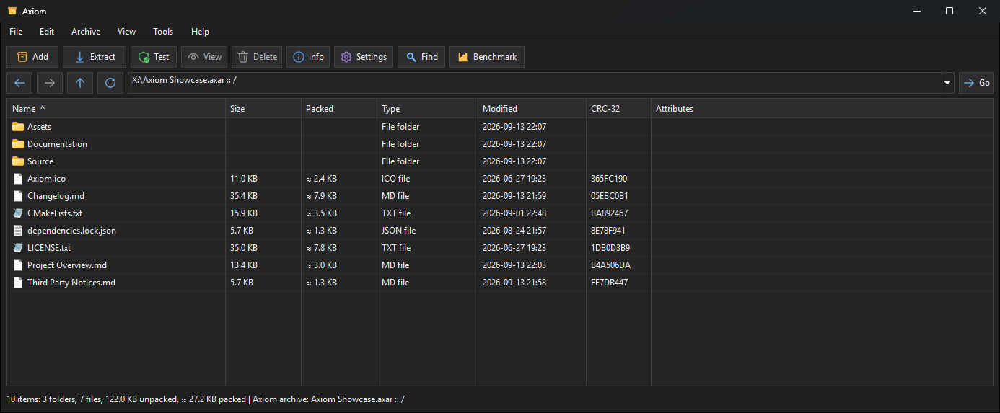
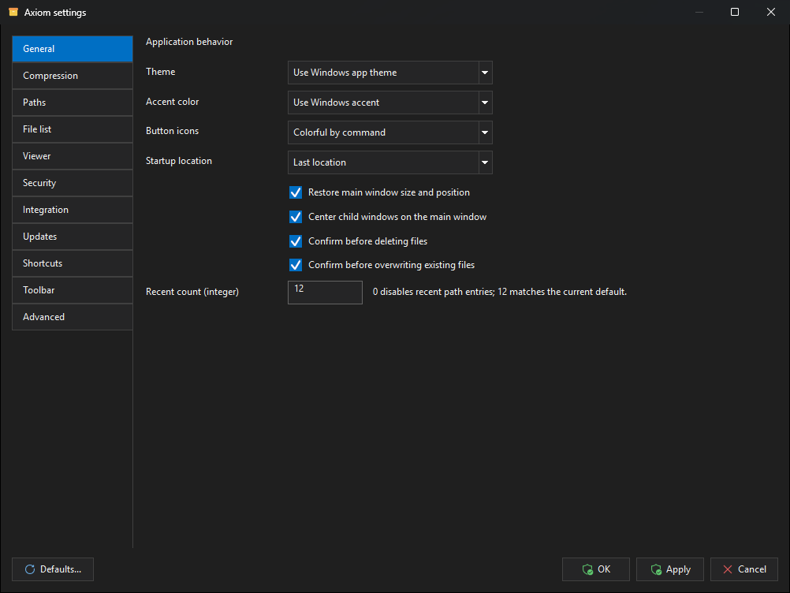
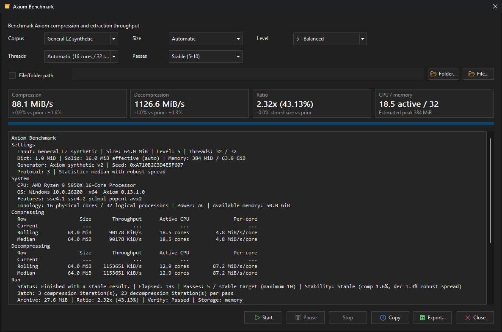

# Axiom for Windows

`Axiom.exe` is a native Win32 archive manager. It is plain Visual C++ and Win32
— no Qt, .NET, WinUI, or embedded browser — and it drives the same library the
[command-line tool](../CLI_GUIDE.md) uses.



## Main window

The window behaves like a file manager. It browses filesystem folders and
archives through the same view:

- Open `.axar` and `.zip` archives for browsing, testing, extraction, and
  editing; open 7z, RAR, ISO, CAB, and TAR-family archives read-only.
- Navigate with the editable address dropdown — paths, drives, shell locations,
  favorites, recent folders, and history.
- Sort, resize, reorder, show, and hide columns; widths and order persist.
- Drag files in from Explorer, drag entries out to Explorer, and move entries
  between folders inside an archive.
- Drop an archive onto the window to open it.

The status bar reports the selection, unpacked and packed totals, and the
active archive.

### Menus

| Menu | Contains |
|---|---|
| File | Open, single-stream compress/decompress, Information, Exit |
| Edit | Select all, Find, Delete, copy path, copy CRC-32 |
| Archive | Add, Extract, Test, Update, Freshen, Synchronize, Repack, Split, Join, comment, lock, recovery, repair, sign, verify, SFX |
| View | Navigation, refresh, tree pane, favorites, column layout |
| Tools | Benchmark, Generate signing key, Delete Axiom temporary files, Settings |
| Help | Check for updates, About Axiom |

### Packed sizes

ZIP reports exact per-entry compressed sizes from its central directory. AXAR
files share solid blocks, so per-file Packed values are proportional estimates
and are marked with `≈`. Archive-level size and ratio are always exact.

## Archive operations

Add, extract, test, delete entries, edit the archive comment, lock, repair from
recovery data, split and join volumes, sign and verify, and build a
self-extracting `.exe`.

AXAR snapshot repositories are identified in the archive capability summary as
**Snapshot repository**. The GUI browses, tests, and extracts their current
snapshot through the normal archive view, while content-changing Add, Update,
Freshen, Synchronize, Delete, Move, and ordinary Repack commands stay guarded
by the snapshot profile rather than risking the historical manifest. Use the
`axiomc snapshot` commands documented in
[CLI_GUIDE.md](../CLI_GUIDE.md#snapshot-repositories), or the public archive
API, for snapshot create/add/list/diff/restore/prune and snapshot garbage
collection. This keeps the native GUI's existing file-manager workflows safe
while making the repository type visible instead of presenting incompatible
legacy controls.

Long operations run on worker threads. The window stays responsive, and
progress shows byte counts, throughput, ETA, output size, and compression ratio
where available. Pause, resume, and cancel use the same cooperative
`OperationControl` path as the CLI, so cancelling leaves no partial output.

Selecting individual AXAR entries uses seekable extraction automatically when
the archive contains an optional subframe map. The operation window reports the
physical archive bytes read while testing or extracting, so a selected restore
can be compared with the archive size. Older archives and blocks that are
encrypted, transformed, or not independently framed continue through the
whole-block path without requiring a setting.

Update, freshen, and synchronize run as a single planned transaction: unchanged
compressed blocks are copied directly, changed and new files are compressed
once, removed files are dropped in the same rewrite, and recovery data is
rebuilt once at the end. Progress reports the compare, copy, compress,
recovery, and commit phases separately. If the source already matches the
archive, nothing is rewritten.

Complete numbered volume sets open directly; reconstruction is only needed when
data parts are missing or damaged.

## Add to archive

Archive creation is one resizable page dialog. The item summary, format, and
output path stay visible while the page body scrolls. Its navigation follows
the compact Settings layout, with the five option pages listed down the left.
The Compression page keeps the live preview beside the form when there is
enough width and moves it out of the way on narrower windows.

| Page | Contains |
|---|---|
| Compression | Method, level, dictionary and word size, solid block size, threads, threading model |
| General | Update mode, archive comment, metadata notes |
| Security | Password, filename encryption, show-password toggle, archive signing |
| Recovery & volumes | Recovery record percentage, split volume size, recovery volumes |
| SFX | Self-extracting output and everything the generated extractor does |

AXAR metadata capture is automatic. File attributes/timestamps, sparse layout,
alternate streams, and supported security or extended attributes are collected
when the source permits them. If a source item or a restore step is incomplete,
the operation result reports the affected paths and the warning text; the result
dialog keeps the operation successful when the loss is best-effort. Use the CLI
or library `strict_metadata` option when metadata loss must fail the operation.

For AXAR the Method list offers Axiom adaptive, Zstandard, LZMA2, Deflate, and
Store. Choosing a method rebuilds the level list and enables only the controls
that mean something: Axiom exposes its threading model, LZMA2 exposes
dictionary and word size plus HC4/BT4, and Zstandard and Deflate keep their
native levels. ZIP creation is deliberately limited to Deflate and Store.

The Axiom and LZMA2 dictionary controls go up to 4 GiB. The 4 GiB choice is
the user-facing form of the largest 32-bit encoded distance/property value
(4 GiB−1). LZMA2 solid-block choices from 8 GiB through 64 GiB use the
disk-staged large-solid profile: codec chunks remain 512 MiB by default and
can grow with the selected dictionary. That profile is LZMA2-only and the
dialog rejects encryption or recovery records for it.

If SFX is enabled, the output path becomes the final merged `.exe` — Axiom does
not leave a separate archive beside it.

### SFX

Signing lives on the Security page with the other authenticity controls, so the
SFX page is only about self-extracting output. Enabling **Create one
self-extracting Windows executable** turns on the rest of the page, which
configures what the finished `.exe` does when someone runs it. The settings are
stored inside the executable itself.

| Setting | Effect |
|---|---|
| Extractor type | Full window shows dialogs; Console only (unattended) uses the smaller decode-only runtime and never prompts. Selecting it disables window title, description, appearance, destination editing, opening the destination, and interface settings |
| Window title | Replaces the default extractor title |
| Default destination | Editable drop-down with common templates such as `%TEMP%\%SFXNAME%`, `%LOCALAPPDATA%\%SFXNAME%`, and `%PROGRAMFILES%\%SFXNAME%`; custom absolute paths and templates are also accepted. `%SFXDIR%` means beside the executable, and an empty value has the same effect |
| Existing files | Replace, skip, or stop |
| Interface | Interactive, silent, or no window |
| Elevation | Never, when the destination needs it, or always |
| Run after extracting | An archive-relative regular file to launch once extraction finishes, plus its arguments; paths cannot escape through `..` or reparse points |
| License text | Shown before extraction when acceptance is required |

For the Console only tier, the extraction settings remain available: default
destination, overwrite behavior, elevation, run-after-extract, and license
handling. The window title, description, appearance, interface mode, destination
editing, and Explorer-open options are disabled because the console runtime does
not use them. Its interface mode is fixed to **No window**.

For the Full window tier, three checkboxes control whether the user may edit the
destination, whether the license must be accepted, and whether the destination
opens when extraction finishes.

Shell folders resolve through the Windows known-folder API rather than
environment variables, so `%ProgramFiles%` cannot be redirected by a variable
set before launch. The program named under **Run after extracting** must be a
regular file the extraction produced; absolute paths, `..`, alternate-data-
stream syntax, and symlink/reparse-point components are rejected. The runtime
also caps worker counts at 4096. Combinations the
extractor would refuse — requiring acceptance with no license text, arguments
with no program, or an unattended elevated run-after chain — are reported when
you select OK rather than failing on the recipient's machine.

Everything on this page is also available from the command line through
`axiomc sfx --config`, documented in
[CLI_GUIDE.md](../CLI_GUIDE.md#configuring-an-extractor).

### Compression profiles

Five built-in profiles cover text and source, executables, structured data,
already-compressed media, and mixed folders. They are tuned as practical
defaults: level 7 for text, structured data, and binaries; level 1 fast
rejection for pre-compressed media; and balanced level 5 for mixed folders.
Levels 8 and 9 stay explicit choices rather than hiding inside a profile.

Saved user profiles also preserve the method, native codec level, LZMA2 match
finder, dictionary and word size, solid block size, thread count, and threading
model.

### Compression preview

For AXAR and ZIP, the right side of the Compression page shows a live prediction
across every level the selected method supports. All points come from the same
sampled source regions, so the curve compares codecs rather than sampling
noise.

Blue is predicted compressed bytes, green is predicted saving, and the neutral
band is the uncertainty range. Click a point to select that level. Changing a
setting that affects the source cancels and re-runs the estimate after a short
pause; changing only the level moves the marker without rescanning.

The preview keeps sampling until every visible level reaches high confidence,
or until its bounded sample/time safety limits are reached. When the limits
win, the preview says that confidence is bounded instead of presenting the
result as exact.

## Settings



Settings are stored per user under `HKCU\Software\AxiomCompress\GUI`, across
eleven pages:

| Page | Covers |
|---|---|
| General | Theme, accent color, icon colors, startup location, confirmations |
| Compression | Default method, level, and threading model |
| Paths | Default output, extraction, and temporary locations |
| File list | Column visibility and order, sorting, display options |
| Viewer | How entries open for preview |
| Security | Password handling and encryption defaults |
| Integration | Per-user file associations and the Explorer submenu |
| Updates | Automatic update checks |
| Shortcuts | Rebindable keyboard shortcuts |
| Toolbar | Button labels or icons-only mode, which buttons appear, and their order |
| Advanced | Diagnostics and low-level behavior |

The General page can follow the Windows accent, use an Axiom preset, or take a
custom color from a DPI-aware picker. The accent applies to selections,
progress indicators, buttons, and optional accent-colored icons.

The Integration page registers per-user associations for AXAR, ZIP/JAR/WAR/APK,
7z, RAR, TAR-family, ISO, and CAB. Read-only formats use embedded Axiom icons
and open into the browser for viewing, testing, and extraction.

Options are wired only where the engine or GUI actually has the behavior.
Unsupported future options are disabled rather than silently stored.

The Toolbar page can keep command labels beside their icons or switch the main
command toolbar to **Icons only**. Tooltips retain the full command names, and
buttons highlight on hover while preserving separate focused, pressed, and
disabled states.

## Benchmark



`Tools > Benchmark…` measures Axiom compression and extraction throughput. It
uses either a generated corpus or a folder or file you choose.

Generated data is created directly in RAM and custom input is preloaded once
before timing, so every compression, decompression, and byte-for-byte
verification pass runs entirely in memory — storage throughput never
contaminates the codec result.

The default synthetic corpus uses deterministic literals and log-distributed
backward matches to exercise the match finder across the active window, rather
than timing a trivially repeated string. Automatic sizing fits the selected
level and available memory, and each measured phase repeats enough to reduce
timer noise. Continuous mode runs until **Stop**, keeping recent-pass detail
plus lifetime throughput, rolling variation, and a stability indicator.

The window measures the native Axiom method only. For cross-codec comparisons
see [BENCHMARKING.md](BENCHMARKING.md).

## Appearance and DPI

System light/dark detection, High Contrast handling, native title bars, and
standard control theming come from the shared `Wimukthi.Win32Theme` framework.
Axiom keeps its own accent palette and owner drawing on top:

- Dark title bars, menus, dialogs, list views, progress controls, combo boxes,
  and custom message boxes.
- Per-monitor DPI-scaled fonts, icons, spacing, and dialog layout.
- Owner-drawn controls where common controls do not dark-theme correctly.
- Shared command IDs across menus, toolbar, shortcuts, and context actions.

## Keyboard shortcuts

All shortcuts are rebindable on the Settings > Shortcuts page. Defaults:

| Action | Shortcut |
|---|---|
| Add to archive | `Ctrl+N` |
| Extract | `Ctrl+E` |
| Test archive | `Ctrl+T` |
| Update / Freshen / Synchronize | `Ctrl+U` / `Ctrl+Shift+U` / `Ctrl+Alt+U` |
| Repack | `Ctrl+Shift+R` |
| Split / Join volumes | `Ctrl+Shift+S` / `Ctrl+J` |
| Edit comment | `Ctrl+M` |
| Lock archive | `Ctrl+Shift+L` |
| Recovery record | `Ctrl+Shift+Y` |
| Repair archive | `Ctrl+Shift+P` |
| Generate signing key | `Ctrl+Shift+K` |
| Sign / Verify | `Ctrl+Shift+G` / `Ctrl+Shift+V` |
| Create self-extracting archive | `Ctrl+Shift+X` |
| Compress / decompress single stream | `Ctrl+Alt+Z` / `Ctrl+Alt+X` |
| Information | `Alt+Enter` |
| Find files | `Ctrl+F` |
| Benchmark | `Ctrl+B` |
| Delete Axiom temporary files | `Ctrl+Shift+Delete` |
| Settings | `Ctrl+,` |
| Select all / Delete | `Ctrl+A` / `Delete` |
| Copy path / Copy CRC-32 | `Ctrl+Shift+C` / `Ctrl+Alt+C` |
| Back / Forward / Up | `Alt+Left` / `Alt+Right` / `Alt+Up` |
| Focus address bar | `Ctrl+L` |
| Refresh | `F5` |
| Show/hide tree pane | `F9` |
| Add / remove favorite | `Ctrl+D` / `Ctrl+Shift+D` |
| Check for updates | `Ctrl+Alt+Shift+U` |
| About Axiom | `F1` |

## Command line entry points

`Axiom.exe` accepts a few startup commands, which is how the Explorer
integration drives it:

```text
Axiom.exe <archive>              open the archive in the browser
Axiom.exe --add <path>...        open Add to archive for those paths
Axiom.exe --extract <archive>    open the extraction flow
Axiom.exe --test <archive>       open the test flow
```

Concurrent `--add` invocations from an Explorer multi-selection are coalesced
into one dialog.

## Housekeeping

`Tools > Delete Axiom temporary files` clears Axiom's staging directory, skips
anything an active operation is using, optionally wipes securely, runs in the
background, and reports the space reclaimed.

Update checks are silent on startup and retry cleanly after a failed check.
`Help > Check for updates` runs one on demand.
