# Using Axiom for Windows

`Axiom.exe` is the Windows app. It browses folders and archives in one window,
and it runs the same engine as the [command-line tool](CLI_GUIDE.md), so
anything you do here you can also script later.

This guide covers the GUI in **0.14.0.0**, including the archive manager,
operation dialogs, settings, and the windows shown by a full self-extractor.
Choose a task below, or use the surface map to find a particular window.

New to the terminology? [GLOSSARY.md](GLOSSARY.md) explains the words in plain
language.

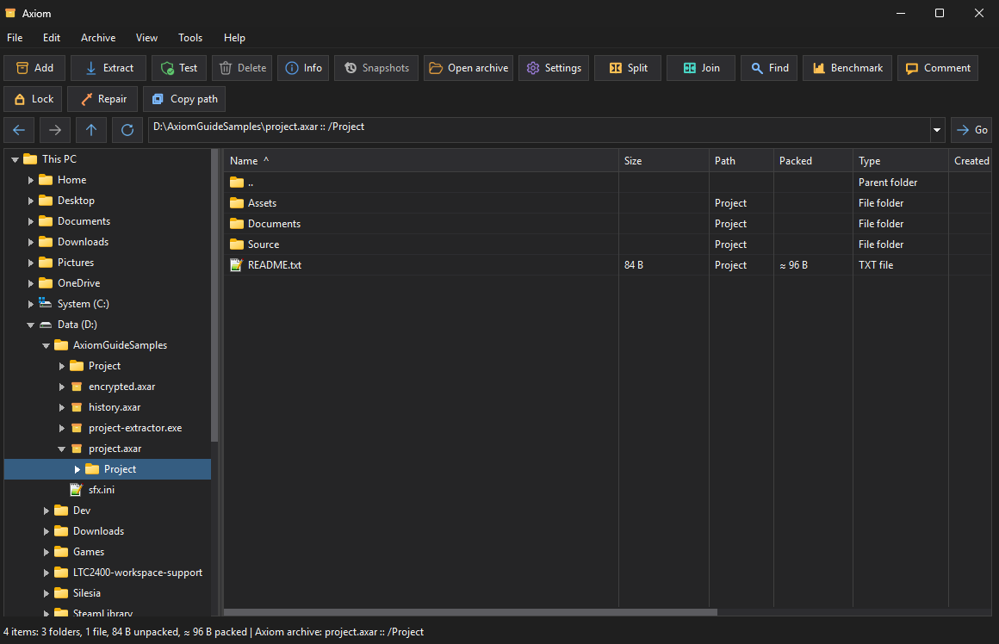

## Contents

- [The main window](#the-main-window)
- [Finding files beyond the current list](#finding-files-beyond-the-current-list)
- [Opening and viewing a file](#opening-and-viewing-a-file)
- [Inspecting files and archives](#inspecting-files-and-archives)
- [Creating an archive](#creating-an-archive)
- [Getting files back out](#getting-files-back-out)
- [Following an operation and reading its result](#following-an-operation-and-reading-its-result)
- [Checking and repairing an archive](#checking-and-repairing-an-archive)
- [Protecting an archive](#protecting-an-archive)
- [Snapshot repositories](#snapshot-repositories)
- [Making a self-extracting .exe](#making-a-self-extracting-exe)
- [Keeping an archive up to date](#keeping-an-archive-up-to-date)
- [Splitting and joining volumes](#splitting-and-joining-volumes)
- [Editing a comment or locking an archive](#editing-a-comment-or-locking-an-archive)
- [Compressing or decompressing a single file](#compressing-or-decompressing-a-single-file)
- [Settings](#settings)
- [Measuring speed on your machine](#measuring-speed-on-your-machine)
- [Checking for updates and viewing About](#checking-for-updates-and-viewing-about)
- [Using file pickers and confirmation dialogs](#using-file-pickers-and-confirmation-dialogs)
- [How it looks](#how-it-looks)
- [Keyboard shortcuts](#keyboard-shortcuts)
- [Starting Axiom from a command or from Explorer](#starting-axiom-from-a-command-or-from-explorer)
- [Housekeeping](#housekeeping)

### Where to find each surface

| Surface | Open it or find its instructions |
|---|---|
| Main browser, menu bar, command toolbar, address dropdown, navigation buttons, tree, file list, and status bar | [The main window](#the-main-window) |
| File-list and tree context menus, favorites, rename, and new-folder prompts | [Everyday file operations](#everyday-file-operations) |
| Instant filter popup | [Filtering the current list](#filtering-the-current-list) |
| Find files and its results table | [Finding files](#finding-files-beyond-the-current-list) |
| Open-file and executable warnings | [Opening and viewing a file](#opening-and-viewing-a-file) |
| Filesystem Information and compression estimate | [Inspecting files and archives](#inspecting-files-and-archives) |
| Archive Information, capabilities, storage components, and largest files | [Archive information](#archive-information) |
| Add to archive and its six pages; source and profile choices | [Creating an archive](#creating-an-archive) |
| Extract archive, batch extraction, and archive password prompt | [Getting files back out](#getting-files-back-out) |
| Operation progress, pause/cancel, completion, warnings, and failures | [Following an operation](#following-an-operation-and-reading-its-result) |
| Recovery percentage and repair confirmation | [Checking and repairing an archive](#checking-and-repairing-an-archive) |
| Secret/public key pickers, signing, and signature result | [Protecting an archive](#protecting-an-archive) |
| Snapshot name, repository creation, timeline, change list, and restore destination | [Snapshot repositories](#snapshot-repositories) |
| SFX authoring page and existing-archive SFX confirmation | [Making a self-extracting .exe](#making-a-self-extracting-exe) |
| Recipient's extraction, password, license, progress, and error windows | [Running a full self-extractor](#running-a-full-self-extractor) |
| Update/Freshen/Synchronize preview and Repack confirmation | [Keeping an archive up to date](#keeping-an-archive-up-to-date) |
| Split size/recovery count and Join file pickers | [Splitting and joining volumes](#splitting-and-joining-volumes) |
| Comment editor and permanent-lock confirmation | [Editing a comment or locking an archive](#editing-a-comment-or-locking-an-archive) |
| Single-file compression/decompression pickers | [Compressing or decompressing a single file](#compressing-or-decompressing-a-single-file) |
| Eleven Settings pages, color picker, column editor, shortcut assignment, and toolbar editor | [Settings](#settings) |
| Benchmark controls, summary cards, report, and CSV export | [Measuring speed](#measuring-speed-on-your-machine) |
| About, update availability, download, and installer-launch prompts | [Checking for updates and viewing About](#checking-for-updates-and-viewing-about) |
| Windows Open/Save/folder dialogs and Setup maintenance | [Using file pickers and confirmation dialogs](#using-file-pickers-and-confirmation-dialogs) |
| Temporary-file cleanup confirmation and report | [Housekeeping](#housekeeping) |

## The main window

The window works like a file manager. The same list shows folders on your disk
and the contents of an open archive, so moving between the two feels the same.

You can:

- Open `.axar` and `.zip` archives to browse, test, extract, and edit them.
  Open 7z, RAR, ISO, CAB, and TAR-family archives to browse, test, and extract
  only — Axiom will not modify those.
- Type or pick a location in the address bar. It accepts paths, drives, shell
  locations such as Documents, your favorites, recent folders, and history.
- Sort by any column, and show, hide, resize, or reorder columns. Your layout
  is remembered.
- Narrow the current list as you type in the instant filter. This works the
  same way in a filesystem folder and inside an archive.
- Copy and paste files, rename one item, or create a folder with the familiar
  Windows shortcuts. In editable AXAR and ZIP archives these commands update
  the archive transactionally.
- Drag files in from Explorer to add them, drag entries out to extract them,
  and drag entries between folders inside an archive to move them.
- Drop an archive file onto the window to open it.

The status bar along the bottom shows what you have selected, the unpacked and
packed totals, and which archive is open.

### The menus

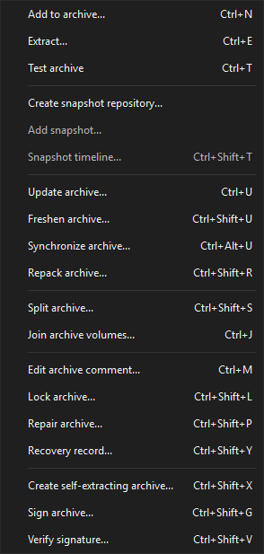

| Menu | What's in it |
|---|---|
| File | Open, compress or decompress a single file, Information, Exit |
| Edit | Copy, Paste, Rename, New folder, Select all, Find, Delete, copy path, copy CRC-32 |
| Archive | Add, Extract, Test, create/add snapshots, Snapshot timeline, Update, Freshen, Synchronize, Repack, Split, Join, comment, lock, recovery, repair, sign, verify, SFX |
| View | Open selected item, navigation, refresh, instant filter, tree pane, favorites |
| Tools | Benchmark, Generate signing key, Delete Axiom temporary files, Settings |
| Help | Check for updates, About Axiom |

The toolbar shows the commands you use most. Choose which buttons appear and
whether they show labels on the **Toolbar** page in Settings. Buttons follow the
editor's fixed command order and wrap when the window is narrow.

Commands become unavailable when the current selection, archive format, lock, or
active operation does not permit them. A read-only archive can still be browsed,
tested, and extracted. Open **Information** to inspect its capabilities.

### Navigating and arranging the browser

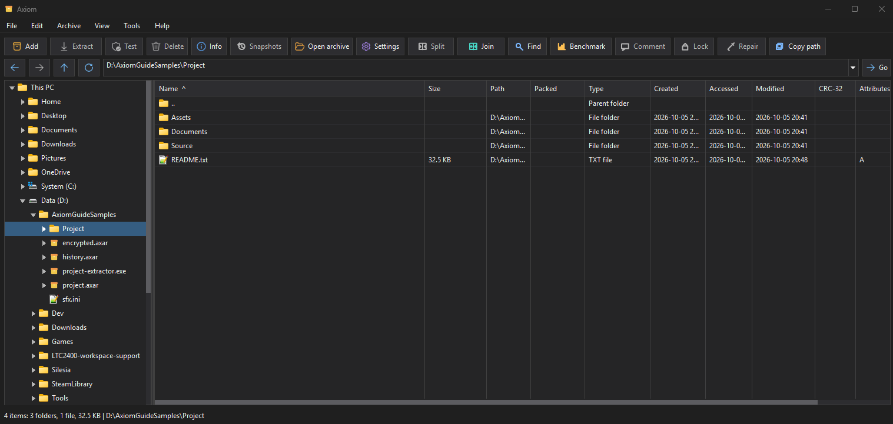

Use **Back**, **Forward**, and **Up** to move through locations. Press `Ctrl+L`,
type a folder or archive path, and press `Enter` to navigate directly. Inside an
archive, the address uses `C:\Backups\work.axar :: /src`: the part before ` ::
/` is the Windows archive path; the part after it is the archive folder.

Open the address dropdown to choose drives, shell folders, favorites, recent
locations, or folders in the current location. **Settings > File list** controls
which of these groups appear; **Settings > General** controls the recent count.
Use **View > Pin current location to Favorites** (`Ctrl+D`) to retain a folder
or archive location, and `Ctrl+Shift+D` to remove it.

Press `F9` to show or hide the tree. Expand a tree node to browse its children,
select a location to open it, and drag the divider to change the pane width.
Right-click a tree node for the commands available for that location.

The tree menu includes Open, Refresh tree, Expand/Collapse, Open in Explorer,
Add to archive, Extract, Test, Information, and favorites where applicable. It
acts on the selected tree node; the file-list menu acts on the list selection.

Click a file-list column header to sort; drag a header to reorder columns or its
edge to resize it. Use **Settings > File list > Customize columns...** to show
or hide fields. The Name column always remains visible and first.

### Why some sizes have a ≈ in front of them

A ZIP file records exactly how many bytes each entry takes, so Axiom shows the
real number.

An AXAR archive compresses groups of files together in a *solid block*, which is
what makes it smaller — but it also means there is no honest per-file answer,
because the files share their compressed bytes. Axiom shows a proportional
estimate and marks it with `≈` so you know it is one.

The archive's overall size and ratio are always exact.

### Filtering the current list

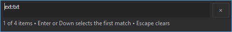

Start typing while the file list is active and a compact filter popup appears.
It updates immediately without rereading the folder or archive and reports the
live match count. The popup stays out of the normal window layout when it is not
needed. Press `Ctrl+Shift+F` to open it directly, `Enter` or `Down` to select
the first match, or `Escape` to clear and close it.

Plain words search names, types, and paths. You can combine as many terms as you
need; every positive term must match, and a term beginning with `-` is excluded.
Quotes keep a phrase together. Useful examples:

| Filter | Result |
|---|---|
| `invoice` | Names, types, or paths containing “invoice” |
| `*.jpg -draft` | JPEG names that do not contain “draft” |
| `type:archive` | Archives only |
| `ext:cpp size:>1MB` | C++ files larger than 1 MiB |
| `date:>=2026-01-01` | Items modified on or after that date |
| `name:"quarterly report"` | Exact phrase within the name |

The status bar reports how many visible items remain out of the complete
location. Deep **Find files** is still available with `Ctrl+F`; it searches
beyond the current list and clears the instant filter when you open a result.

### Everyday file operations

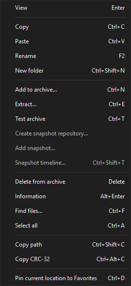

`Ctrl+C` and `Ctrl+V`, `F2`, and `Ctrl+Shift+N` provide Copy, Paste, Rename, and
New folder. Filesystem operations go through the Windows shell, including its
collision and elevation handling. Copying from an archive first extracts the
selected roots to Axiom's managed temporary area, then publishes a normal
Windows file list, so it can be pasted into Explorer or another application.

Inside an editable AXAR or ZIP, Paste and New folder add entries, while Rename
moves the selected archive path without recompressing more than the format
requires. Locked archives, filename-encrypted archives, split archives that
cannot be edited, and read-only formats keep these commands disabled.

Right-click the list for View, Copy, Paste, Rename, New folder, archive
commands, Information, Find, selection, path/checksum copying, and favorites.
The menu adapts to the location and selection. **Copy CRC-32** copies a recorded
checksum when the selected entry has one; it does not calculate a missing
checksum.

For **Rename**, select one item and enter its new name. **New folder** asks for
a name in the current location. These prompts accept a name, not a destination
path. Filesystem **Delete** asks to move the selection to the Recycle Bin when
confirmation is enabled. Archive **Delete** removes entries from the archive;
they do not go to the Recycle Bin.

## Finding files beyond the current list

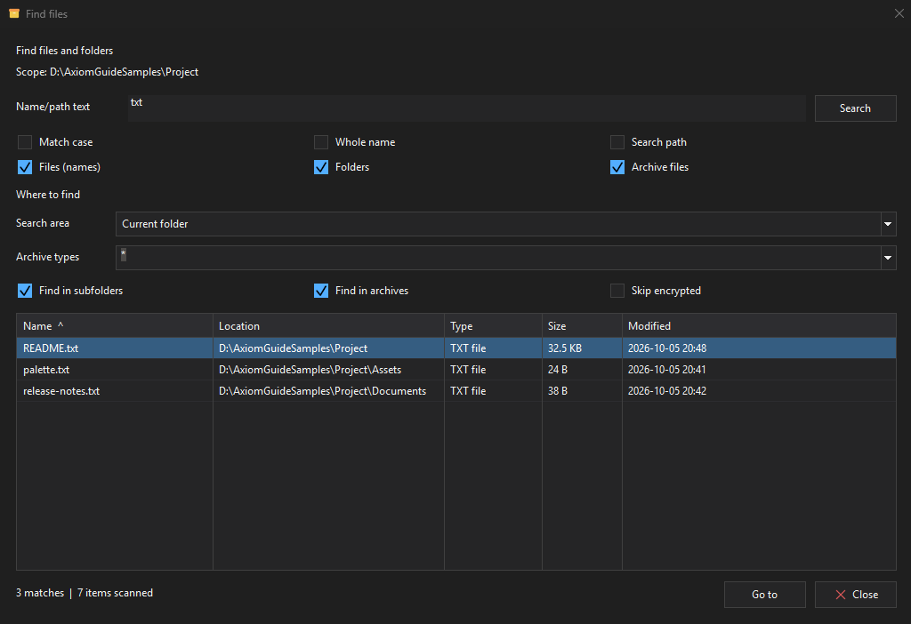

Choose **Edit > Find files...** (`Ctrl+F`) when the instant filter is too
narrow. The search window looks for names and, optionally, paths; it does not
search text inside files.

1. Enter **Name/path text**, or leave it empty to list every matching item.
2. Choose the search area and whether to include child folders and archives.
3. Select **Search**. Select a result and choose **Go to**, or double-click it,
   to open its location and select it in the main browser.

| Control | How to use it |
|---|---|
| Match case | Require the same uppercase and lowercase letters |
| Whole name | Match the complete name, or complete path when searching paths, instead of a substring |
| Search path | Include each item's relative path in the name search |
| Files (names), Folders, Archive files | Choose which kinds of results appear |
| Search area | Choose Current folder/Current drive, Current archive folder/Entire archive, or This PC, according to the open location |
| Find in subfolders | Include descendants; filesystem reparse-point folders are not followed |
| Find in archives | Inspect supported archives encountered in the search area |
| Archive types | Enter semicolon-separated filename patterns such as `*.axar;*.zip`; `*` includes all supported types |
| Skip encrypted | Exclude archives reported as encrypted; unreadable encrypted directories otherwise produce warnings |

Results show Name, Location, Type, Size, and Modified. The window reports scan
progress, skipped encrypted archives, read warnings, and a result-limit notice
when the result set is truncated. Narrow the search if that notice appears.
After the first search, changing the text or search options updates the results.
**Close** leaves the main location unchanged; **Go to** clears its instant
filter so the chosen result is visible.

## Opening and viewing a file

Double-click a folder to enter it, or an archive to browse it. Select an
ordinary file and use **View > Open selected item**, the **View** toolbar
button, or double-click it to open it with an application.

A filesystem file opens through Windows. An archive file entry is first
extracted to a temporary folder. **Settings > Viewer** can require confirmation
before this happens and can warn separately for executable or script files.
Decline either prompt to leave the file unopened.

Configure a viewer executable to use it instead of the Windows file association.
The editor executable acts as a fallback when no viewer is configured. Saving
changes in that application changes the temporary copy; Axiom does not put the
edited file back into the archive automatically. Add the saved file explicitly
if you want to update the archive.

## Inspecting files and archives

Press `Alt+Enter`, choose **File > Information**, or use **Info** on the
toolbar. The window depends on what you are inspecting.

### Filesystem information and estimates

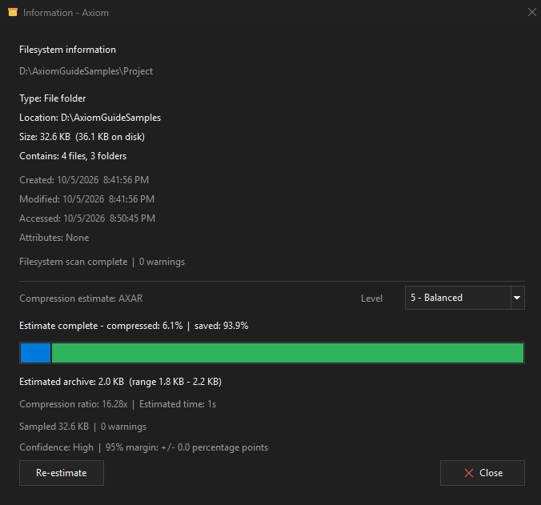

Select one or more ordinary files or folders. With no selection in a filesystem
folder, Information inspects that folder. It scans in the background and shows
type, location, logical size, allocated size on disk, file/folder counts,
timestamps, attributes, and any scan warnings. A multiple selection can show
**Multiple values** where there is no single shared value.

To estimate how well the inputs will compress, choose a level from 1 through 9
and press **Estimate**. Read the predicted archive size, size range, ratio,
estimated time, sampled bytes, and confidence. The estimate creates no archive.
Press **Cancel** while estimation is running, **Re-estimate** to try again, or
**Close** to leave the window. This sampled estimate is separate from the
multi-level preview in Add to archive.

### Archive information

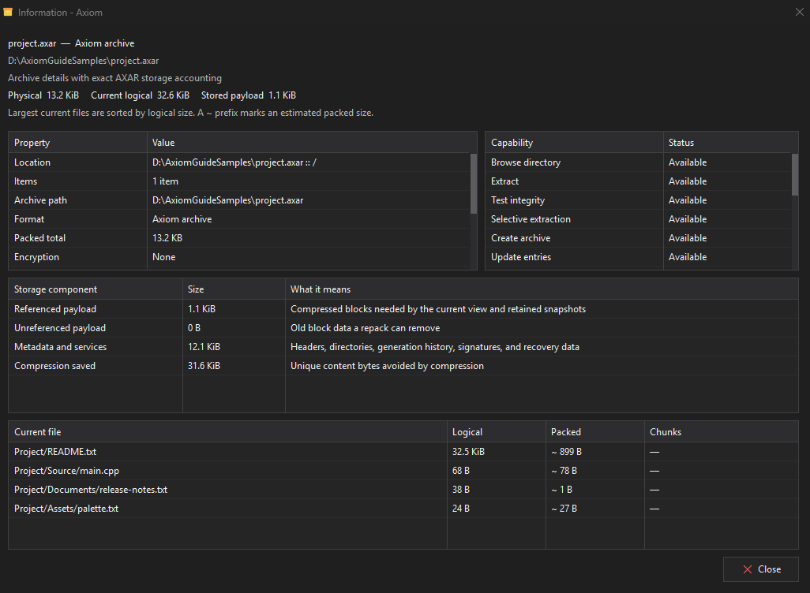

Open or select an archive and choose Information. When browsing one, the
selected-entry or selection summary appears alongside the archive totals.

| Area | What to inspect |
|---|---|
| Archive details | Path, format, sizes, encryption, editable/locked state, comment, and snapshot or deduplication profile where applicable |
| Capabilities | Operations the provider makes available for this archive |
| Storage components | AXAR payload, unreferenced data, metadata/services, compression savings, deduplication savings, and content retained only by older snapshots |
| Largest current files | Files sorted by logical size, with packed size and chunk counts where available |

AXAR accounting distinguishes compressed data still needed by files or snapshots
from old unreferenced data that a repack can remove. Other formats show
provider-reported sizes rather than AXAR's internal accounting. A `~` or `≈`
prefix marks an estimated packed size.

When inspecting an archive selected on disk, **Estimate...**, when available,
opens the filesystem information/estimate window for that archive file. It
estimates compressing the selected file itself, not recompressing its contents.
Use **Close** to leave Information, and **Snapshot timeline** to inspect
history.

## Creating an archive

Select the files and folders you want, then press **Add** on the toolbar, or
`Ctrl+N`, or right-click them in Explorer and use the Axiom submenu.

The current filesystem selection can contain files, folders, or both. Folders
are included recursively. If there is no longer a live selection, or if you are
adding entries to an open archive, Axiom asks whether you want to choose a
folder or one or more files.

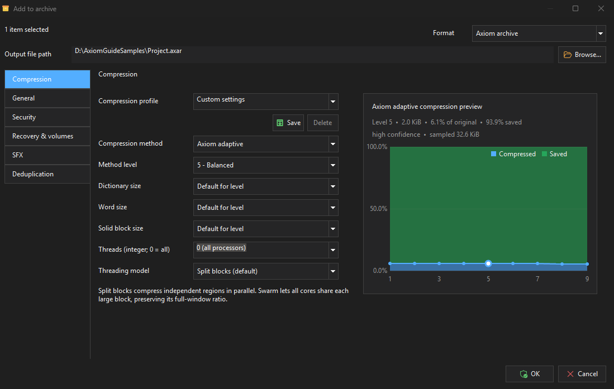

Everything lives in one resizable dialog. What you selected, the format, and the
output path stay pinned at the top while the rest scrolls. The six option pages
are listed down the left side:

| Page | What you set there |
|---|---|
| Compression | Method, level, dictionary and word size, solid block size, threads, threading model |
| General | Update mode, archive comment, permanent lock, repack after update, metadata notes |
| Security | Password, filename encryption, show-password toggle, archive signing |
| Recovery & volumes | Recovery record percentage, split volume size, recovery volumes |
| SFX | Whether to produce a self-extracting `.exe`, and what it does when run |
| Deduplication | Live content deduplication and its minimum, average, and maximum chunk sizes |

If you change nothing at all, you get an AXAR archive at level 5 using Axiom's
own method — a reasonable default for almost anything.

Use **Browse...** beside the output path to choose where the archive or SFX
executable goes. **OK** validates the inputs and starts the operation;
**Cancel** closes without creating the archive. Scroll the selected page or use
`Tab` to reach controls below the visible area. Hover a control for its input
rules. Unavailable settings depend on the selected format and operation.

### Choosing how to add the inputs

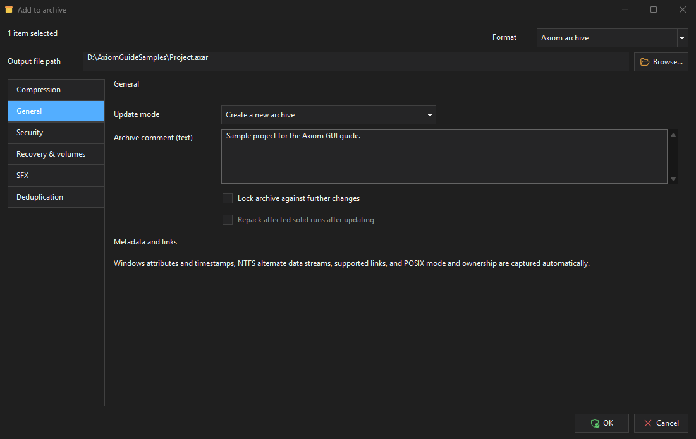

On **General**, choose **Create a new archive** for a new output, or an update
mode when changing an existing archive:

| Update mode | Use it to |
|---|---|
| Add or replace entries | Add missing entries and replace matching entries from the chosen inputs |
| Update entries that are newer | Add missing entries and replace older archived copies |
| Freshen existing entries | Replace older archived copies only; do not add missing entries |
| Synchronize with source | Mirror the complete source, including removing entries absent from it |

Review the [change plan](#keeping-an-archive-up-to-date) before the update runs.
Use **Archive comment** for a note stored with an AXAR. **Lock archive against
further changes** is permanent; leave it off for an archive you will update.
**Repack affected solid runs after updating**, when available, removes
superseded data through an additional archive pass. The metadata notes describe
automatic capture rather than offering switches for every metadata kind.

### Choosing a method and level

For AXAR, the **Compression method** list offers Axiom adaptive, Zstandard,
LZMA2, Deflate, and Store. Picking one rebuilds the level list and greys out the
controls that don't apply to it, so you never set something that will be
ignored: Axiom exposes its threading model, LZMA2 exposes dictionary and word
size plus its HC4/BT4 match finder, and Zstandard and Deflate keep their own
native level numbers.

ZIP archives can only use Deflate or Store. That's a deliberate limit — those
are what every other tool can read.

The dictionary controls for Axiom and LZMA2 go up to 4 GiB. Choosing 4 GiB gives
you the largest value the file format can hold, which is one byte short of 4
GiB.

For LZMA2 only, solid block sizes from 8 GiB to 64 GiB switch on a disk-staged
mode: the raw data goes to a temporary file and is compressed in bounded pieces,
so a huge block doesn't need a huge amount of memory. The dialog will not let
you combine that mode with encryption or recovery records.

### Watching the size before you commit

For AXAR and ZIP, the right-hand side of the Compression page predicts the
result at every level the chosen method supports, while you are still deciding.

Blue is the predicted compressed size, green is the predicted saving, and the
pale band around them is how uncertain the estimate still is. Click any point to
select that level.

All the points come from the same sampled regions of your files, so the curve
compares *levels* rather than comparing different parts of your data. Changing
something that affects which bytes are read cancels the estimate and restarts it
after a short pause; changing only the level just moves the marker.

The preview keeps sampling until every visible level is confident, or until it
hits its own time and sample limits. If the limits win, it says the confidence
is bounded rather than presenting a guess as a fact.

### Profiles

Five built-in profiles cover text and source code, executables, structured data,
already-compressed media, and mixed folders. They use level 7 for text,
structured data, and binaries; level 1 for pre-compressed media, where the point
is to give up quickly rather than waste CPU; and level 5 for mixed folders.

Levels 8 and 9 are deliberately not hidden inside a profile. If you want to
spend that much time, say so.

Saving your own profile keeps the method, native codec level, LZMA2 match
finder, dictionary and word size, solid block size, thread count, and threading
model.

To save a profile, adjust the Compression controls, type a name in **Compression
profile**, and select **Save**. Select a saved profile to restore those
controls. **Delete** removes a user profile; built-in profiles cannot be deleted
or overwritten. Profiles do not save the password, signing key, destination, or
every option on the other pages. Saved or deleted profiles remain changed even
if you later cancel Add to archive; Cancel prevents archive creation, not
profile management.

### Deduplicating repeated content

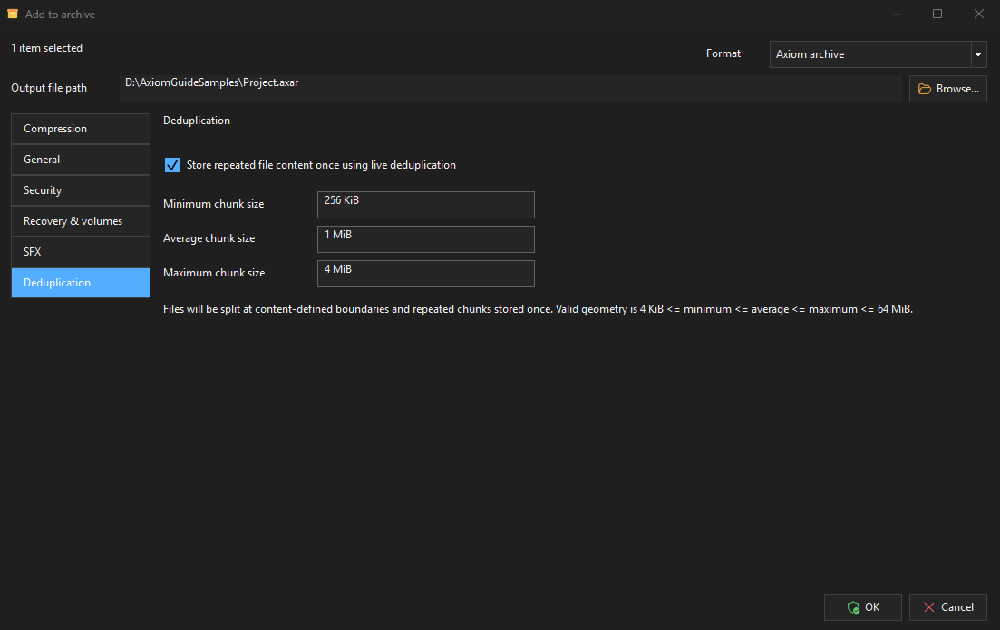

On the **Deduplication** page, switch on **Store repeated file content once** to
create an AXAR whose files share repeated and unchanged regions. This is useful
for source trees, virtual-machine images, and rolling backups where a small edit
would otherwise make another large copy.

The default 256 KiB minimum, 1 MiB average, and 4 MiB maximum chunk sizes suit
general backups. Smaller chunks can discover more overlap at the cost of more
directory records. The three values must stay in order and within 4 KiB through
64 MiB.

Deduplication is selected only when creating a new AXAR. When you later use Add,
Update, Freshen, Synchronize, Delete, Move, or Repack, Axiom detects the
archive's stored profile and preserves its original chunk geometry. Open
**Information** to see whether **Live content deduplication** is active.

### What Axiom records about your files

For AXAR archives this happens automatically: file attributes and timestamps,
sparse file layout, NTFS alternate data streams, and supported security or
extended attributes are all captured when the source allows it.

If some item couldn't be read, or a piece of metadata couldn't be captured, the
result dialog lists the affected paths and explains what was lost. The operation
still counts as successful when the loss was best-effort. If losing metadata
should instead fail the whole operation, use the CLI's `--strict-metadata`
option.

### Adding recovery data or split output during creation

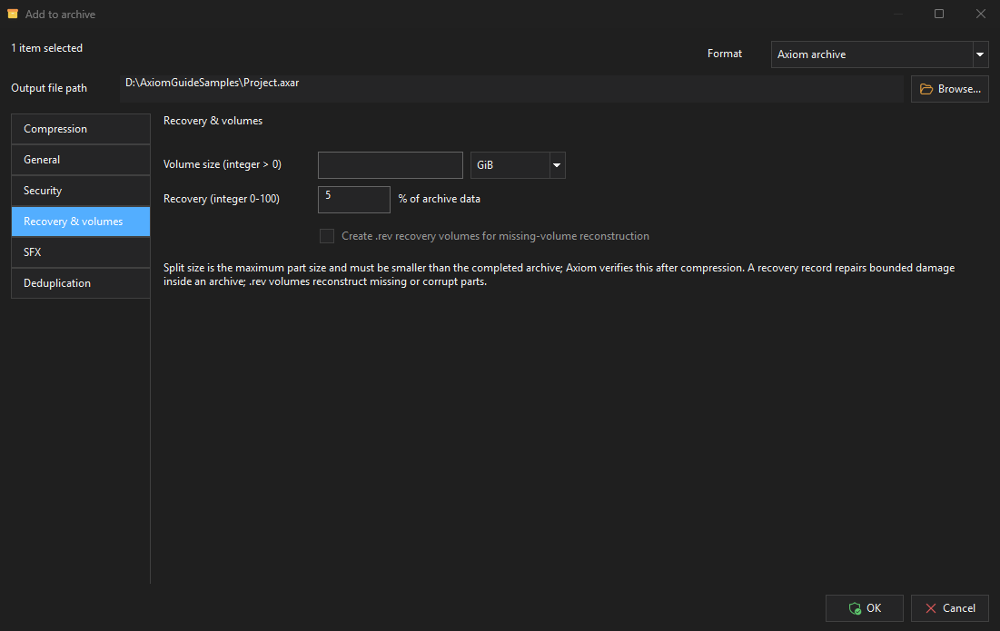

On **Recovery & volumes**, leave **Volume size** empty for one archive. For
split output, enter a positive integer and choose KiB, MiB, GiB, or TiB. The
completed archive must be larger than the requested part size; Axiom checks this
after compression.

Set **Recovery** to 1–100 to add spare repair data to an AXAR, or 0 to omit it.
For AXAR split output, **Create .rev recovery volumes** adds separate parts that
can reconstruct missing or corrupt volumes. It requires both splitting and a
recovery percentage. ZIP supports standard split volumes but not AXAR recovery
records or `.rev` recovery volumes.

SFX output uses a single executable and cannot also be split. The dialog
disables combinations unavailable for ZIP, snapshot repositories, or large LZMA2
solid blocks. See [Splitting and joining
volumes](#splitting-and-joining-volumes) to split an archive you already have.

## Getting files back out

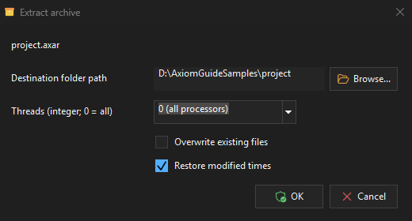

Open or select an archive and press **Extract**, or `Ctrl+E`, to restore the
whole archive. The Extract command does not limit the operation to the selected
rows or current archive subfolder.

To recover only selected files or folders, drag those entries into Explorer, or
**Copy** them and paste them into a destination folder. Selecting a folder
includes everything inside it. Opening an individual entry also uses selective
extraction to prepare its temporary copy.

In **Extract archive**, review these controls and choose **OK** to start:

| Control | What to choose |
|---|---|
| Destination folder and Browse | Where the restored files should go |
| Threads | A count up to the available logical processors; 0 uses all processors |
| Overwrite existing files | Permit replacement of paths already at the destination |
| Restore modified times | Apply the recorded last-modified timestamps |

**Cancel** leaves the destination untouched. An encrypted archive can first show
**Archive password**: enter its password, optionally use **Show password**, then
choose **OK**. A nonempty password is required; **Cancel** stops the flow.
Password prompting and reuse for archive viewing/editing depend on **Settings >
Security**; extraction can still request a password separately. Passwords are
not saved in the registry.

The extraction dialog does not expose every CLI option. In particular, use the
CLI for `--max-output` and for restoring privileged metadata explicitly. See
[Archives you don't trust](CLI_GUIDE.md#archives-you-dont-trust) and
[SECURITY.md](SECURITY.md) for the limits of extraction.

In a filesystem folder, select two or more archives and choose **Extract** to
run a batch. Pick one destination root and Axiom creates one subfolder per
archive (`Photos`, `Photos (2)`, and so on when names collide). The progress bar
covers the complete batch. Without **Overwrite** enabled, an existing target
folder stops the batch before any archive is extracted. Selecting several
members of the same recognized split-volume set counts as one archive, so the
set is never extracted repeatedly.

Dragging out happens in two steps, and both report progress. Axiom first unpacks
what you dragged into a temporary folder, then Windows copies it to where you
dropped it. You get a progress window for each, and Cancel works in both.

Long operations run on background threads, so the window stays usable.

When selected entries are extracted from a large AXAR archive, Axiom reads only
the compressed pieces those files need, provided the archive records where its
pieces begin. Older archives, and encrypted or filtered blocks, fall back to
reading the whole block.

If an archive was split into numbered Axiom volumes and you still have all the
data parts, open any one of them to read the set directly. Join the volumes when
you need a single archive or reconstruction using recovery parts.

## Following an operation and reading its result

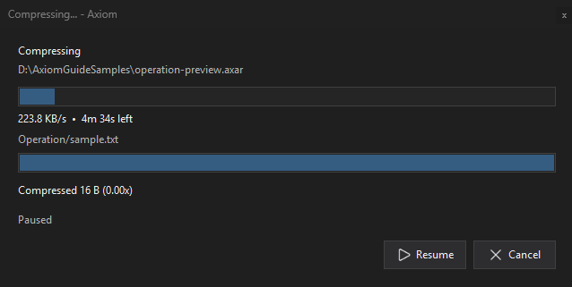

The progress window shows the stage, overall and per-file bars, the current
speed and time remaining, and the item being worked on. Where they apply, it
also shows the compressed size and ratio so far, and how much data was reused
rather than recompressed. Optional summaries stay in place once reported,
including while an operation changes stages.

When an operation runs in several stages, the overall bar covers the whole
thing, while the speed and time remaining describe the stage you're in. The
window says which is which.

**Pause** takes effect at a safe checkpoint and changes to **Resume**.
**Cancel**, or closing the progress window, requests cancellation at the next
safe checkpoint; an active codec can take time to reach it. Completed extracted
files can remain in the destination. Cancellation is not an undo command for
files already restored or Windows copies already completed.

On completion, the progress window closes and the browser refreshes. A result
message reports success or failure; a successful operation with warnings uses a
warning message and lists up to eight affected paths, followed by a count of
additional warnings. Read those warnings before treating a backup or restore as
complete. A cancelled operation reports its state in the status bar without a
success dialog.

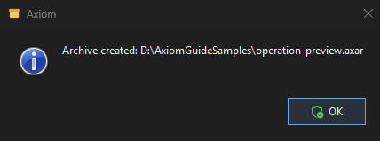

## Checking and repairing an archive

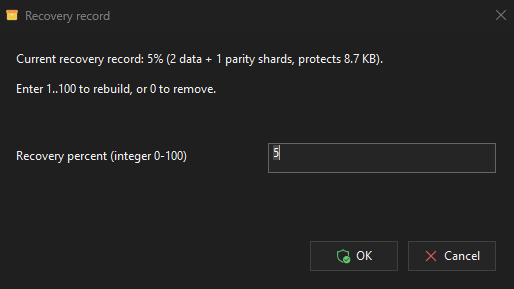

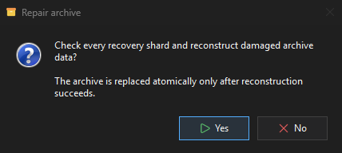

**Test** (`Ctrl+T`) decompresses everything and verifies every checksum without
writing any files. That includes data no current file uses, such as pieces kept
only for older snapshots and blocks left behind by replaced files. It is the
right thing to run after making a backup and before deleting the previous one.

If a test reports damage and the archive has a recovery record, **Repair**
(`Ctrl+Shift+P`) rebuilds the damaged parts. A recovery record can only absorb
so much: it is protection against a few bad sectors, not against a failed drive.
Keep a second copy elsewhere.

Add or change a recovery record from the **Archive** menu, or on the **Recovery
& volumes** page when you create the archive.

Choose **Archive > Test archive** (`Ctrl+T`) to check the open or selected
archive, then read the result message. Testing verifies stored data without
extracting files. An encrypted archive may ask for its password.

To change an existing AXAR's recovery data, choose **Archive > Recovery
record...**. The input dialog shows the current percentage, shard counts, and
protected size when a record exists. Enter 1–100 and choose **OK** to create or
rebuild the record. Enter 0 to remove it; Axiom asks for confirmation before
removing an existing record. **Cancel** leaves it unchanged.

Choose **Archive > Repair archive...** to use an existing record. Confirm the
prompt to check the recovery shards and reconstruct damaged data. Axiom reports
when no recovery record exists. It replaces the archive only after
reconstruction succeeds, then reports the result. Repair cannot recover more
damage than the stored recovery data permits.

## Protecting an archive

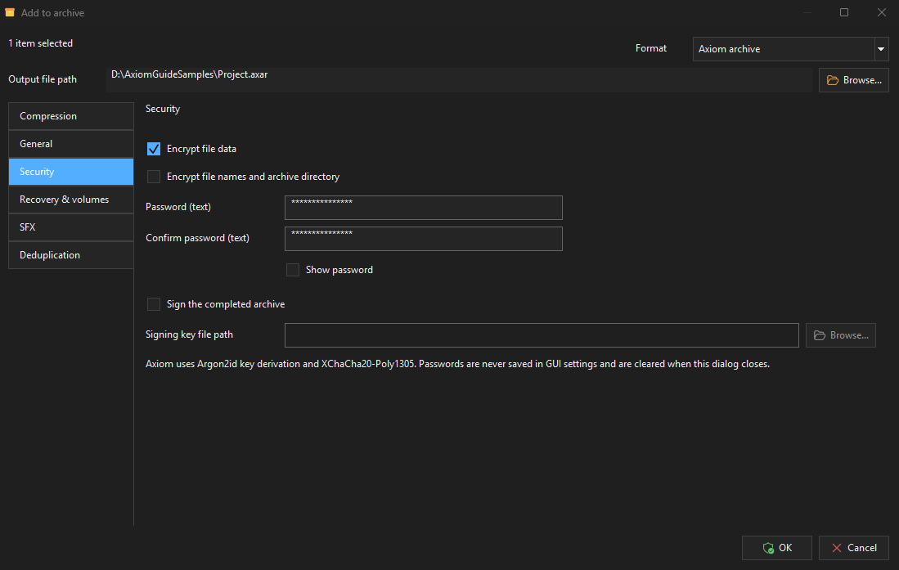

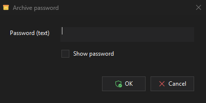

The **Security** page of the Add dialog covers passwords and signing.

**A password** encrypts the file data. Anyone can still see the file names,
sizes, and checksums unless you also switch on filename encryption, which seals
the archive's index too. With that on, even listing the archive needs the
password.

Axiom derives the encryption key with Argon2id and encrypts with
XChaCha20-Poly1305. ZIP archives use WinZip AES-256 instead, and ZIP file names
are always visible — if names must be hidden, use AXAR.

**Signing** proves an archive came from you and hasn't been altered since.
Generate a key pair from **Tools > Generate signing key**, sign with the secret
key, and give people the public key to verify with. Editing a signed archive
invalidates the signature, which is the point.

To encrypt a new archive, enable **Encrypt file data**, enter the password
twice, and use **Show password** only if you want to inspect both entries.
**Encrypt file names and archive directory** also enables data encryption. The
fields must match before **OK** starts the operation.

### Generating, using, and checking signing keys

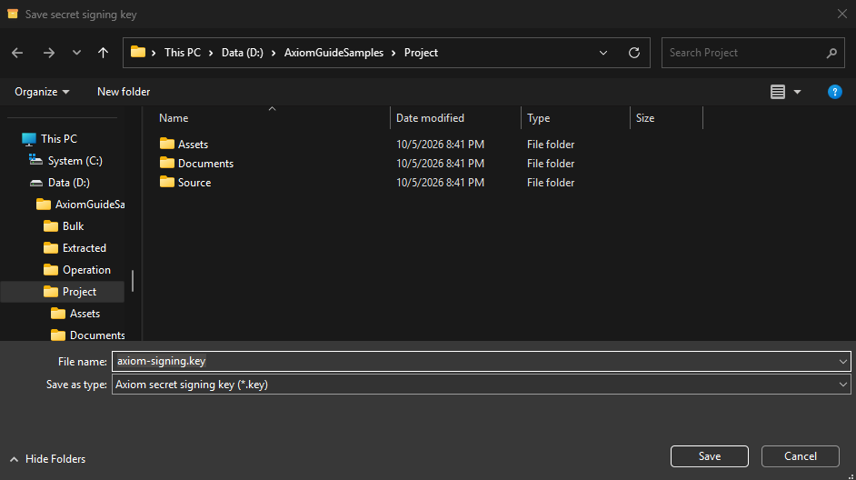

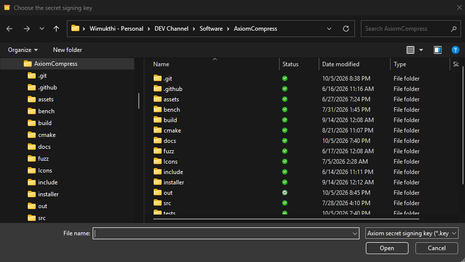

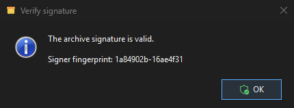

1. Choose **Tools > Generate signing key...**. Use the two Save dialogs to
   choose separate paths for the secret `.key` and public `.pub` files.
2. Keep the secret key private. Select **Sign the completed archive** and its
   key path on Add's Security page, or choose **Archive > Sign archive...**
   and select an existing secret key.
3. Give the public key to recipients. They can put trusted public-key files in
   the folder selected under **Settings > Security**.
4. Choose **Archive > Verify signature...** to see whether the archive is
   signed, whether its signature is valid, its signer fingerprint, and its
   trust status when a trusted-keys folder is configured.

A secret signing key is 64 bytes; the matching public key is 32 bytes and cannot
sign. Signing is an AXAR capability, not a ZIP feature. A valid signature
confirms the data matches its embedded key; trusting that signer requires a
public key obtained through a source you trust. Encrypted archives may request a
password for signing or verification.

## Snapshot repositories

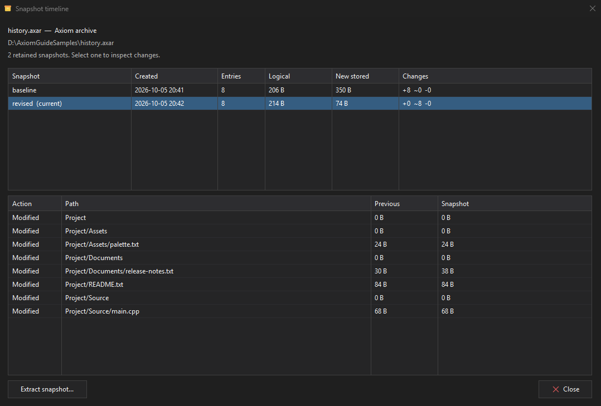

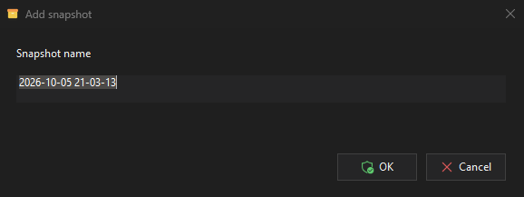

An AXAR archive can also be a *snapshot repository*: several dated versions of
the same folder, stored without duplicating the unchanged parts. Axiom
identifies these in the archive information as **Snapshot repository**.

To start one, select the source folder or files and choose **Archive > Create
snapshot repository...**. Name the initial snapshot, choose the repository path,
and review the normal compression, encryption, recovery-record, and
deduplication settings. Snapshot repositories always use AXAR and keep their
chunk profile for every later capture.

Open the repository and choose **Archive > Add snapshot...** for each new point
in time. Choose the same complete source root or file set used before: omitted
items are intentionally recorded as removals. Axiom suggests a timestamp name,
rejects duplicates in the repository, and stores only content that is not
already present. Split volumes, recovery volumes, signing, locking, and SFX
output are unavailable during repository creation because they would prevent
later snapshots from being appended.

Press **Snapshots** on the toolbar, choose **Archive > Snapshot timeline**, or
press `Ctrl+Shift+T` to open the history directly. Select any retained snapshot
to see additions, modifications, and removals from the preceding point in time.
**Extract snapshot...** restores the selected version to a folder without
changing the repository.

The name prompt starts with **Initial** for repository creation and a suggested
timestamp for a later capture. Enter a unique name and choose **OK**, or
**Cancel** to abandon that capture. The initial repository uses the normal
six-page archive dialog with its format fixed to AXAR. Adding a later snapshot
asks for its complete source and name while preserving the repository profile.

The timeline table shows snapshot name, creation time, entry count, logical
size, newly stored data, and change counts. Its lower table shows each added,
modified, or removed path with previous and selected-snapshot sizes. Select a
row before choosing **Extract snapshot...**; review the normal extraction
destination and overwrite controls, then restore it. **Close** leaves the
repository as it was. Pruning snapshots is a CLI task rather than a timeline
button.

The normal browser continues to show the current snapshot. Commands that would
change ordinary archive content — Add, Update, Freshen, Synchronize, Delete,
Move, and ordinary Repack — stay disabled because they would discard history.
**Information** combines the archive's metadata and capabilities with exact
storage, deduplication, history-only content, and largest-file accounting.

The `axiomc snapshot` commands remain available for scripts, comparisons, and
pruning; see [CLI_GUIDE.md](CLI_GUIDE.md#snapshot-repositories).

## Making a self-extracting .exe

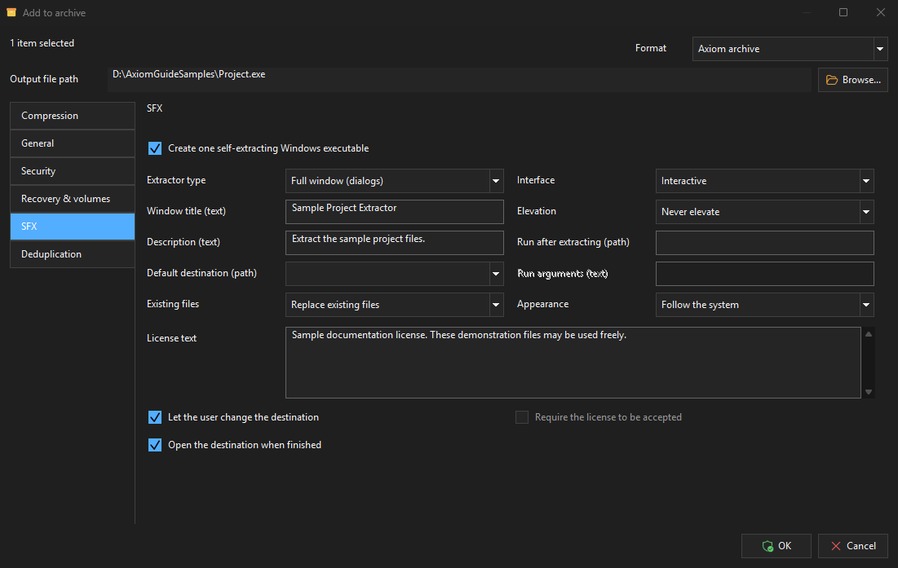

A self-extracting archive is your archive glued onto a small extractor program,
so the whole thing is one `.exe`. Whoever receives it doesn't need Axiom.

Switch on **Create one self-extracting Windows executable** on the SFX page. The
output path then becomes the finished `.exe` — Axiom does not leave a separate
archive next to it. All the settings below are stored inside the executable, so
they travel with it.

| Setting | What it does |
|---|---|
| Extractor type | **Full window** shows dialogs. **Console only (unattended)** uses a much smaller runtime and never prompts, which suits something a script unpacks. Choosing it disables the settings that only a window can use |
| Window title | Replaces the default title |
| Description | Shows a short explanation of the package in the full extraction window |
| Appearance | Follow the Windows theme, always use light, or always use dark |
| Default destination | A drop-down with common templates such as `%TEMP%\%SFXNAME%`, `%LOCALAPPDATA%\%SFXNAME%`, and `%PROGRAMFILES%\%SFXNAME%`. You can type your own absolute path too. `%SFXDIR%` means "next to the executable", and leaving it empty means the same |
| Existing files | Replace them, skip them, or stop |
| Interface | Interactive, silent, or no window at all |
| Elevation | Never ask for administrator rights, ask only when the destination needs them, or always ask |
| Run after extracting | A file from inside the archive to launch once extraction finishes, plus its arguments |
| License text | Shown before extraction, when acceptance is required |

For **Console only**, the extraction behaviour is all still available —
destination, overwrite policy, elevation, run-after-extract, and the license.
Only the window-related settings are disabled, and the interface mode is fixed
to **No window**.

For **Full window**, three checkboxes control whether the recipient may change
the destination, whether they must accept the license, and whether the
destination folder opens when extraction finishes.

### The safety rules it enforces

Shell folders such as `%ProgramFiles%` are resolved through the Windows
known-folder API rather than through environment variables, so somebody can't
redirect the destination by setting a variable before launching the extractor.

The program named under **Run after extracting** must be a real file that the
extraction itself produced. Absolute paths, `..`, alternate-data-stream syntax,
and anything passing through a symbolic link or junction are all rejected.

Combinations the extractor would refuse are caught when you press OK, not on the
recipient's machine: requiring acceptance with no license text, arguments with
no program, or a completely unattended chain that also elevates and runs
something.

Everything on this page is available from the command line too, through `axiomc
sfx --config`, documented in
[CLI_GUIDE.md](CLI_GUIDE.md#configuring-an-extractor).

### Converting an existing archive

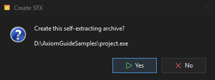

Open or select an archive that supports SFX, then choose **Archive > Create
self-extracting archive...** (`Ctrl+Shift+X`). The confirmation shows the
proposed `.exe` beside the source archive. Accept it to package the existing
archive. This shortcut does not open the six-page options dialog. To author the
destination, description, license, and other embedded choices in the GUI, create
the SFX through Add to archive instead.

### Running a full self-extractor

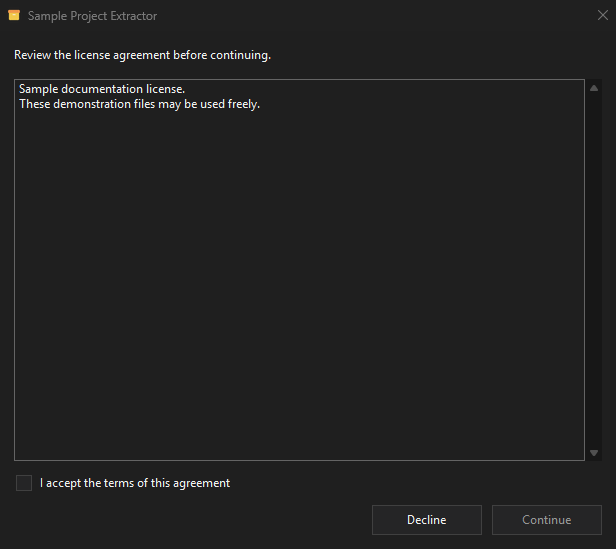

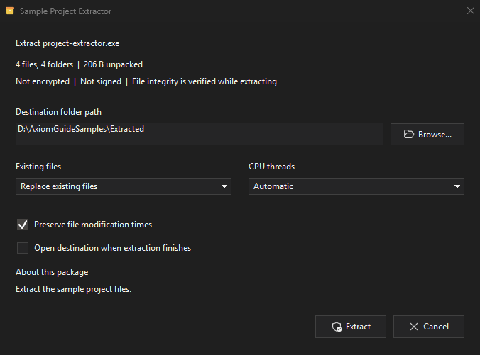

In interactive mode, the recipient sees the package title, unpacked file/folder
counts, encryption/signature information, and any description or archive
comment. Review the destination and choose **Extract** to start, or **Cancel**
to stop before extraction.

| Recipient control | What it changes |
|---|---|
| Destination folder path and Browse | Choose where files go, when the author permits destination changes |
| Existing files | Replace, skip, or stop on a file already present |
| CPU threads | Use Automatic or one of the available processor counts |
| Preserve file modification times | Restore the archived last-modified times |
| Open destination when extraction finishes | Open the output folder after a successful extraction |

An encrypted package asks for its password. If license acceptance is required,
the license window shows scrollable text and **I accept the terms of this
agreement**. Select that checkbox to enable **Continue**. **Decline** stops
extraction. A configured elevation policy can also show the Windows UAC prompt.

Extraction then uses a progress window with Pause/Resume and Cancel. Errors and
warnings appear through the extractor's message windows. **Silent** mode skips
the normal setup dialog but can show progress and errors. **No window** and the
console-only extractor provide no interactive GUI; their configured destination
and policies must already be suitable for unattended use.

The extractor's signature display concerns the archive signature. It is separate
from a Windows publisher signature on the executable.

## Keeping an archive up to date

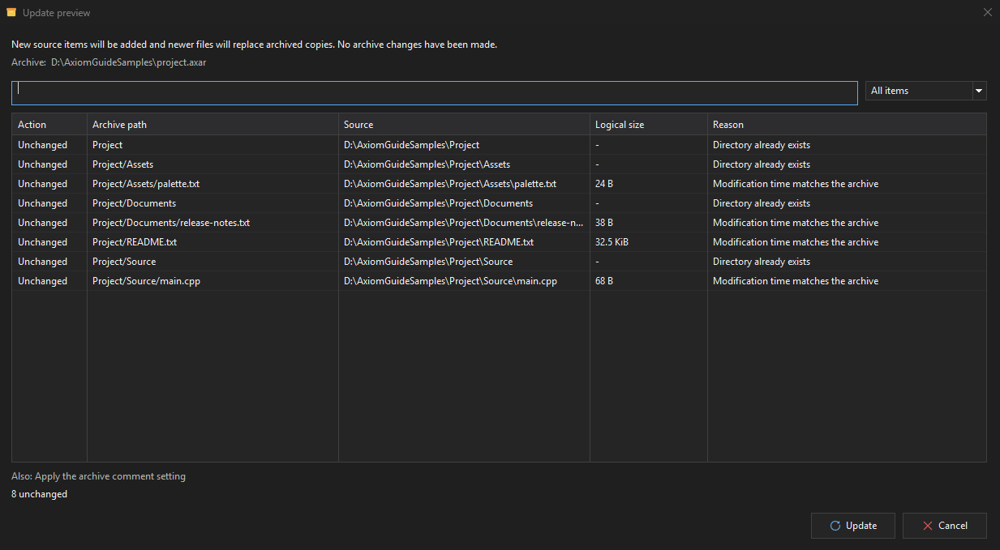

Three commands refresh an existing archive from its source folder:

| Command | Adds new files | Replaces changed files | Removes deleted files |
|---|:--:|:--:|:--:|
| Update | ✓ | ✓ | — |
| Freshen | — | ✓ | — |
| Synchronize | ✓ | ✓ | ✓ |

After you choose the source and compression options, Axiom opens a read-only
change plan before touching the archive. The plan lists each addition,
replacement, removal, unchanged entry, ignored entry, and path or type conflict.
Use its search box and action filter to inspect large plans; the footer shows
counts and logical-size impact. Synchronization removals are highlighted, and
conflicts disable the operation until the source mapping is safe.

When you approve the plan, Axiom scans both the archive and source again. If
anything changed while the preview was open, it displays a refreshed plan and
requires another approval. Canceling either preview leaves the archive
untouched.

All three run as one planned pass. Files that haven't changed are copied across
still compressed — they are never decompressed and recompressed. Changed and new
files are compressed once. Deleted files are dropped in the same rewrite, and
any recovery record is rebuilt once at the end.

Progress reports the compare, copy, compress, recovery, and commit stages
separately, so a long run tells you which part it is in. If the source already
matches the archive, nothing is rewritten at all.

**Repack** rebuilds an archive to reclaim the space left by earlier deletions
and replacements, and merges duplicate file contents into a single stored copy.

The preview window's **All items**, **Changes only**, **Added**, **Replaced**,
**Removed**, **Unchanged**, **Ignored**, and **Conflicts** filters select rows;
they do not change the planned operation. Search matches archive paths, source
paths, and reasons. Review the source/archive sizes and explanation for each
change, then use the action button to proceed or **Cancel** to leave it alone.

For **Archive > Repack archive...**, confirm the rebuild prompt before the
progress window opens. Ordinary repacking recompresses live files; it can take
as long as creating the archive again. The compression defaults affect that
operation, so check **Settings > Compression** first. Snapshot repositories keep
ordinary Repack disabled to preserve their history.

## Splitting and joining volumes

Use split output when a single archive is too large to transfer as one file.
Keep every part of a set together and keep their original names.

### Splitting an existing archive

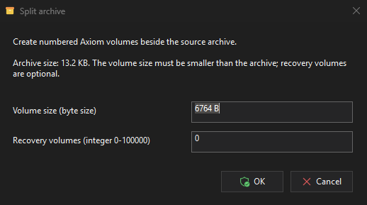

Choose **Archive > Split archive...** (`Ctrl+Shift+S`) for an archive whose
provider supports volume creation. The dialog shows the archive size. Enter a
positive **Volume size**, such as `700M`, smaller than the source archive. For
AXAR, also enter a **Recovery volumes** count; 0 creates none. Choose **OK** to
write the parts beside the source, or **Cancel** to leave it alone.

AXAR produces numbered Axiom parts and optional `.rev` recovery volumes. ZIP
produces a standard `.z01`, `.z02`, ..., `.zip` set, with no recovery-volume
count. Split ZIP sets are read-only in the GUI. Axiom validates the number and
size of AXAR parts before starting and rechecks whether the source changed.

### Joining Axiom volumes

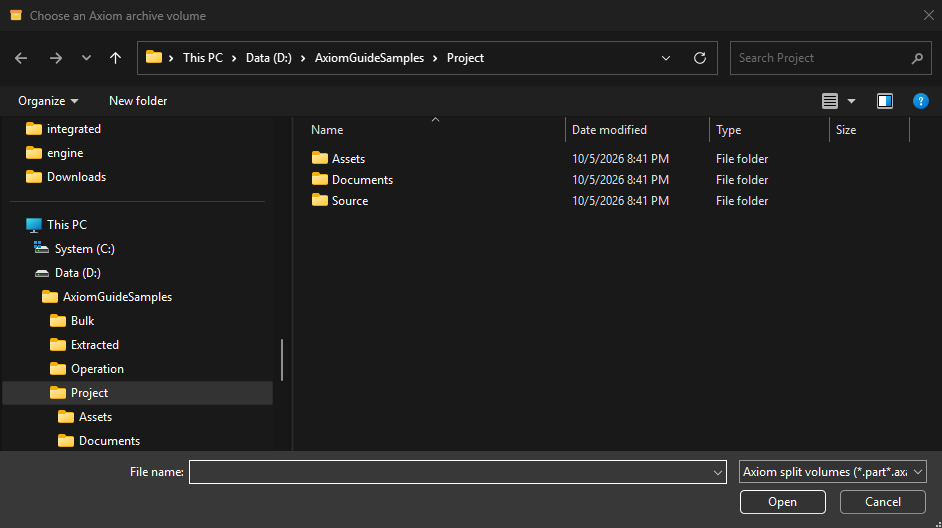

Choose **Archive > Join archive volumes...** (`Ctrl+J`). Select an Axiom
`.part*.axar` or `.rev*` volume, then choose a different output `.axar` path in
the Save dialog. The operation assembles the archive and opens the result. This
Join command handles Axiom volume sets; it is not a general-purpose ZIP or RAR
volume joiner. Read or extract supported foreign split archives through the
browser instead. See [FORMAT_SUPPORT.md](FORMAT_SUPPORT.md) for format limits.

## Editing a comment or locking an archive

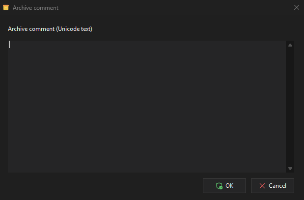

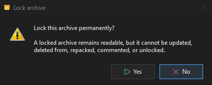

Choose **Archive > Edit archive comment...** (`Ctrl+M`) for an editable AXAR.
Edit the Unicode text in the multiline editor and select **OK** to save it.
**Cancel** keeps the existing comment. Information displays the stored comment.

Choose **Archive > Lock archive...** (`Ctrl+Shift+L`) only when the archive will
no longer need changes. The warning explains that locking is permanent: the
archive remains readable, but update, deletion, repacking, comment editing, and
unlocking are unavailable. Choose **No** to keep it editable, or **Yes** to
apply the lock. Password encryption and locking serve different purposes.

## Compressing or decompressing a single file

Use **File > Compress single file...** (`Ctrl+Alt+Z`) to choose an input file
and a separate output path. The Save dialog suggests the original filename with
`.axc` appended. The operation uses the current compression defaults. An `.axc`
is one compressed stream, rather than a browsable archive of entries.

Use **File > Decompress stream...** (`Ctrl+Alt+X`) to choose an `.axc` and its
restored file path. Axiom suggests removing `.axc`, or adding `.out` for other
input names. Input and output must differ. Cancel either picker to stop before
the operation; otherwise follow its normal progress and result windows.

## Settings

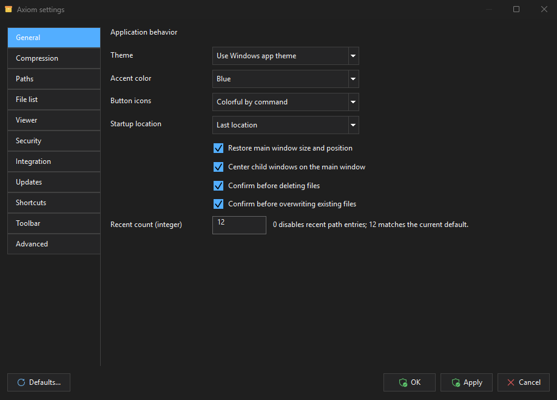

Settings live under your own Windows user account, in the registry at
`HKCU\Software\AxiomCompress\GUI`. There are eleven pages:

| Page | What it covers |
|---|---|
| General | Theme, accent color, icon colors, startup location, confirmations |
| Compression | Default compression, update mode, volume/recovery, SFX, and signing choices |
| Paths | Default output, extraction, and temporary locations |
| File list | Hidden items, parent entry, grid/selection/scrolling, address dropdown, and columns |
| Viewer | How entries open when you preview them |
| Security | Password prompting/cache, verification, trusted keys, and plaintext temporary-file wiping |
| Integration | File associations and the Explorer right-click submenu |
| Updates | Automatic update checks |
| Shortcuts | Every keyboard shortcut, rebindable |
| Toolbar | Labels or icons-only and which buttons appear in the fixed command order |
| Advanced | Diagnostics and low-level behaviour |

The **General** page can follow the Windows accent color, use one of Axiom's
presets, or take a custom color from a DPI-aware picker. The accent shows up in
selections, progress indicators, buttons, and — if you want — the icons.

The **Integration** page registers file associations for AXAR, ZIP (including
JAR, WAR, and APK), 7z, RAR, the TAR family, ISO, and CAB. These are registered
for your user account only. Read-only formats get Axiom's icons and open into
the browser for viewing, testing, and extracting.

Options are only present where the engine actually implements the behaviour.
Anything not yet supported is disabled rather than quietly stored and ignored.

Open **Tools > Settings...** (`Ctrl+,`). Select a page on the left and scroll
its controls as needed. **Apply** saves validated changes and keeps Settings
open; **OK** saves and closes it. Before the first Apply, **Cancel** leaves
settings unchanged. After Apply, Cancel does not restore the earlier settings,
and some later page edits can also be retained. Review your choices and use OK
when finishing a session in which you have used Apply.

### General: appearance and startup

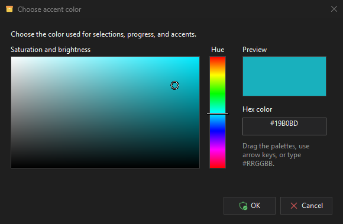

| Control group | What to set |
|---|---|
| Theme | Follow the Windows app theme, or select Dark or Light |
| Accent color | Use the Windows accent, Axiom amber, a preset, or Custom |
| Custom accent and Pick color | Enter `#RRGGBB`, or open the color picker; select Custom to use the value |
| Button icons | Choose theme-tinted monochrome, colorful by command, or accent-colored icons |
| Startup location | Restore the last location, open This PC/Desktop, or choose a custom folder |
| Window placement | Restore the main window's size/position and choose whether child windows are centered |
| Confirmations | Ask before deleting files or overwriting existing files |
| Recent count | Limit remembered path entries; 0 hides recent entries |

In **Pick color...**, drag the saturation/brightness palette and hue strip, use
arrow keys, or type a hexadecimal color. The preview reflects a valid value.
**OK** returns it to Settings; **Cancel** keeps the previous value. Apply
Settings to use the chosen accent.

### Compression: defaults for future operations

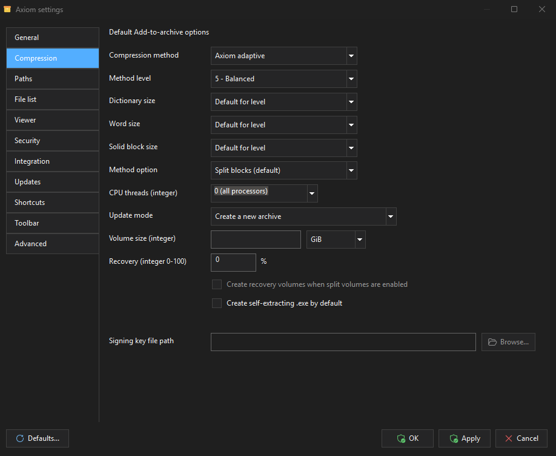

Set method, native level, dictionary, word size, solid block size, method
option, and CPU thread count. The method option is Axiom's threading model or
LZMA2's match finder where applicable. The page also sets the default update
mode, volume size/unit, recovery percentage, recovery-volume checkbox, SFX
checkbox, and signing checkbox/key path.

These defaults populate later Add dialogs; review the operation's own choices
before starting. Choosing SFX disables split output. Recovery volumes require
splitting and recovery data. Signing enables the key field. The password is
entered for the operation and is never a saved compression default.

### Paths: output and temporary folders

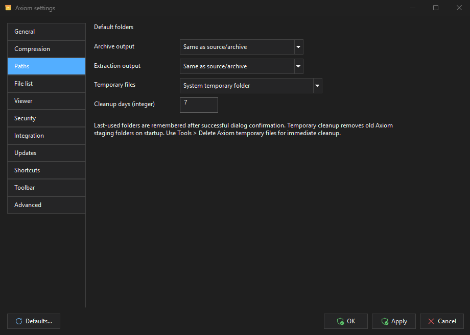

For archive and extraction output, choose **Same as source/archive**, **Last
used**, or **Custom folder**. Browse for a custom path when that policy is
selected. The last-used folder is remembered after confirming the dialog.

For temporary files, choose the system temporary folder, Axiom's temporary
folder, or a custom folder. **Cleanup days** controls startup removal of old
Axiom staging folders. For immediate cleanup, use the Tools command described
under [Housekeeping](#housekeeping).

### File list: browsing and columns

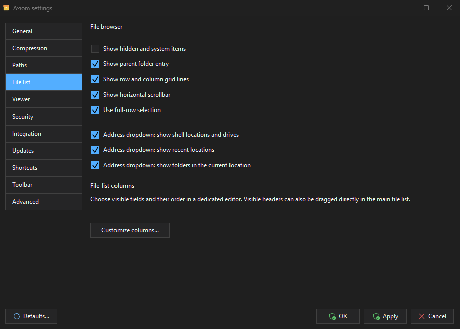

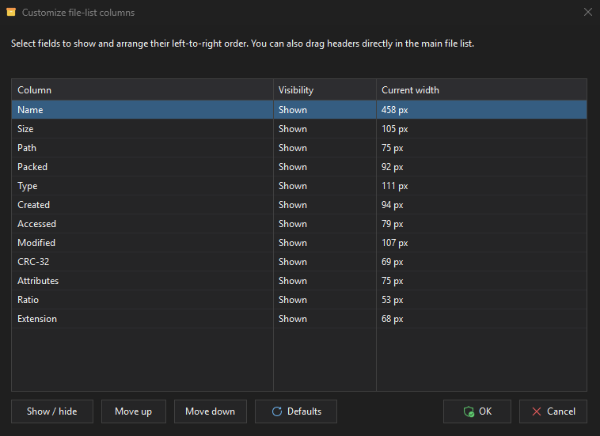

Choose whether to show hidden/system items, the parent-folder entry, grid lines,
a horizontal scrollbar, and full-row selection. The three address dropdown
switches show shell locations/drives, recent locations, and folders in the
current location independently.

Choose **Customize columns...** to open the column editor. Its table shows each
column, its visibility, and its current width. Select a row and use **Show /
hide**, double-click, or press `Space` to toggle it. Use **Move up** and **Move
down** to change its left-to-right order. **Defaults** restores visibility,
widths, and order in the editor. **OK** returns the layout to Settings; apply
Settings to use it. **Cancel** discards the editor's changes. Name stays visible
and first.

The available columns are Name, Size, Packed, Type, Modified, CRC-32,
Attributes, Ratio, Extension, Created, Accessed, and Path. Some archive formats
cannot supply every field; a blank field is not proof that its value is zero.

### Viewer: opening archived files

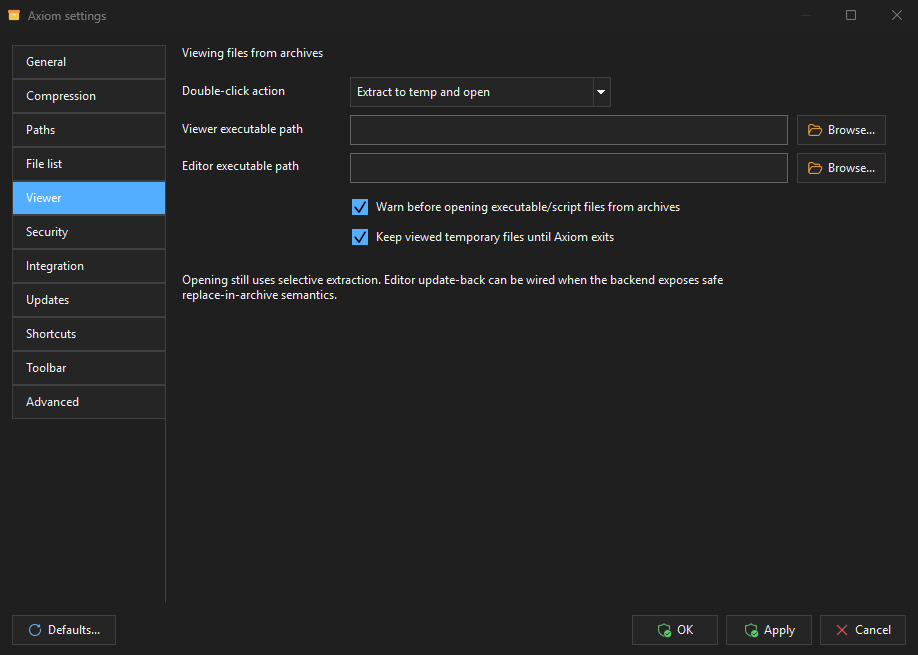

Choose whether double-click extracts to temporary storage and opens the file
immediately, or asks first. Browse for a viewer executable or fallback editor,
enable executable/script warnings, and choose whether viewed temporary files
stay until Axiom exits. When that retention option is off, cleanup follows the
launched application rather than waiting for Axiom to close. Edited temporary
files are not saved back into the archive automatically.

### Security: passwords, trust, and temporary plaintext

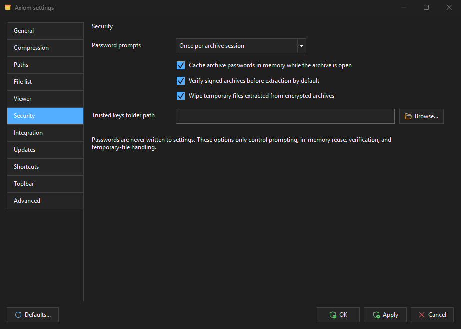

Choose **Once per archive session** or **Every operation** for password
prompting, and whether passwords can be cached in memory while an archive is
open. Enable default signature verification before extraction and choose a
trusted-keys folder containing Axiom public keys. The verification result
distinguishes a valid signature from a signer trusted by that folder.

**Wipe temporary files extracted from encrypted archives** overwrites their
temporary plaintext before deleting it. It controls temporary-file cleanup, not
the ordinary files you deliberately extract to a destination. Passwords are
never written to settings. See [SECURITY.md](SECURITY.md) for the security
boundaries and remaining limitations.

### Integration: associations and Explorer commands

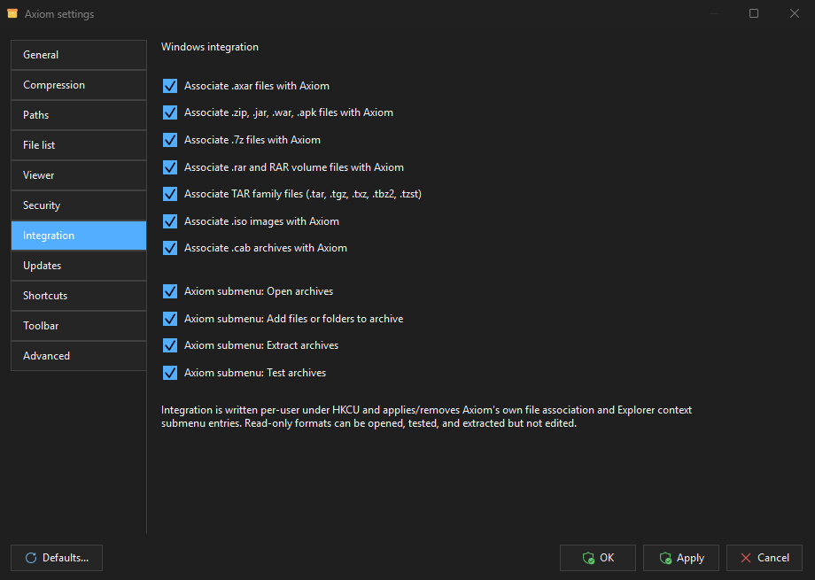

Select the desired association groups, then apply Settings. The groups cover
AXAR; ZIP/JAR/WAR/APK; 7z; RAR and its volumes; TAR/TGZ/TXZ/TBZ2/TZST; ISO; and
CAB. Separately enable **Open**, **Add**, **Extract**, and **Test** in
Explorer's Axiom submenu. Clearing a choice removes Axiom's own registration for
that choice. Windows can still require you to select your default app in its
settings; registration does not bypass Windows' default-app controls.

### Updates: feed and startup checking

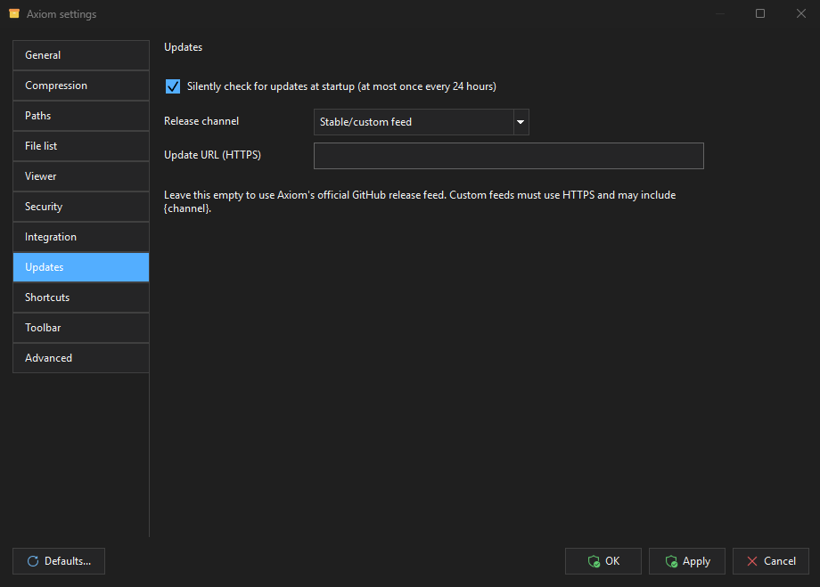

Enable or disable the silent startup check, which runs at most once every 24
hours. Select **Stable/custom feed** or **Preview/custom feed**. Leave **Update
URL (HTTPS)** empty for the official GitHub feed, or enter an absolute HTTPS
custom feed URL. A custom URL may contain `{channel}`. The channel selection
follows the releases provided by that feed. Updates require your confirmation;
startup checks do not install them automatically.

### Shortcuts: assigning a key chord

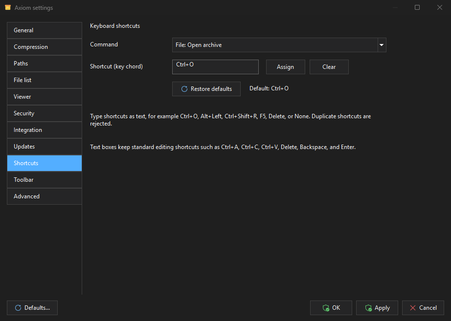

Choose a **Command**, type a chord such as `Ctrl+O`, `Alt+Left`, or `F5`, and
select **Assign**. Use `None` or **Clear** to disable its shortcut. Duplicate
non-contextual chords are rejected. **Restore defaults** restores the whole
shortcut set; apply Settings to use the changes.

Text boxes retain normal editing keys such as `Ctrl+A`, `Ctrl+C`, `Ctrl+V`,
Delete, Backspace, and Enter. The main command bound to one of those keys does
not take over while you are typing in a text field.

### Toolbar: showing commands and labels

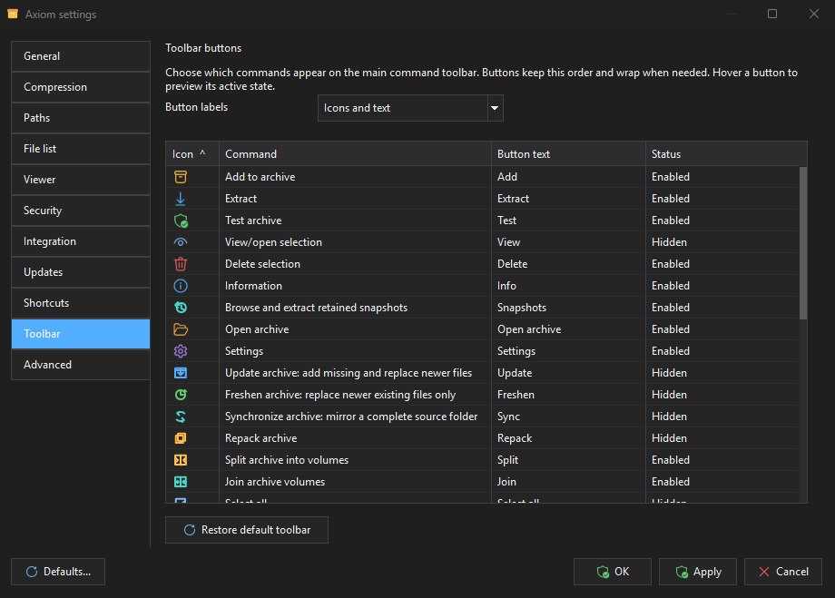

Choose **Icons and text** or **Icons only**. Select a command in the table and
change its Status between **Enabled** and **Hidden**. Double-click the row or
press `Space` to toggle it. The table shows its icon, full command name, button
text, and status; buttons keep that fixed catalog order. There is no toolbar
reordering control. **Restore default toolbar** resets the visible set. Apply
Settings to update the main toolbar; icons-only buttons retain their tooltips.

### Advanced: operation resources and diagnostics

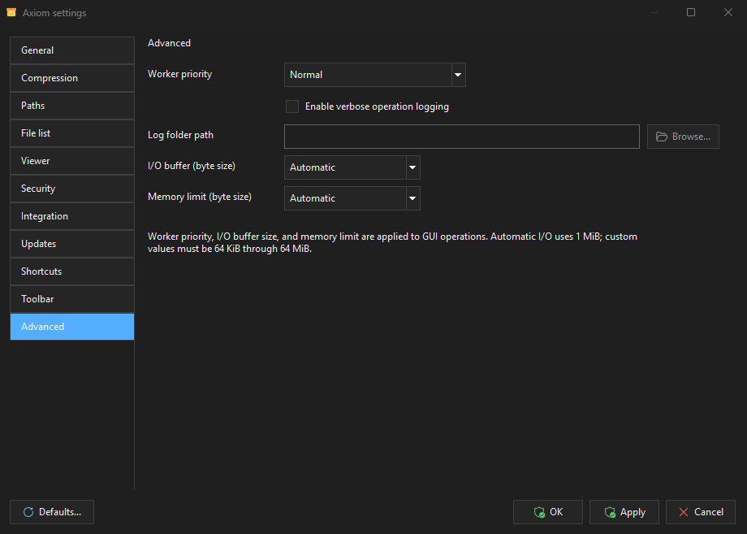

Choose Normal, Below normal, or Background worker priority to control how
archive operations compete with other applications. Enable verbose operation
logging and choose its folder when diagnosing a problem; logs can contain file
paths.

Set I/O buffer and memory limit to **Automatic**, or select **Custom** and enter
a positive size with B, KiB, MiB, GiB, or TiB. Automatic I/O uses 1 MiB; a
custom I/O buffer must be 64 KiB–64 MiB. A custom memory limit must be at least
64 KiB and fit the build's address space. A memory budget does not replace the
CLI's decoded-output limit for untrusted archives. Apply validated values before
starting another operation.

## Measuring speed on your machine

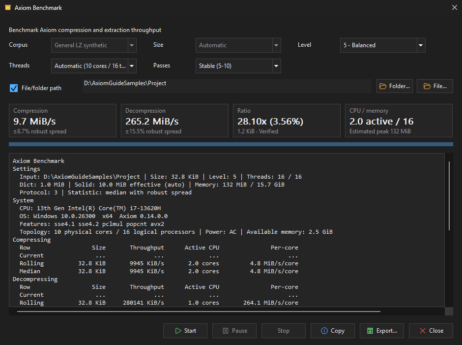

**Tools > Benchmark…** (`Ctrl+B`) measures how fast Axiom compresses and
extracts on the machine you're sitting at. It uses either a generated test
corpus or a file or folder you choose.

Choose the inputs and select **Start**. **Pause** changes to **Resume** while a
run is paused; **Stop** requests a stop and retains the recorded report. Use
**Copy** for readable text, **Export...** for a CSV Save dialog, and **Close**
to leave the window. Stop or finish a run before starting another.

| Input control | What to choose |
|---|---|
| Corpus | General LZ synthetic, Structured text/log, or Incompressible random |
| Size | Automatic, 16 MiB, 64 MiB, 256 MiB, or 1 GiB for generated input |
| Level | Axiom level 1–9 |
| Threads | Automatic or a count drawn from the machine's processor topology |
| Passes | 1, 3, Stable (5–10), 10, or Continuous |
| File/folder path checkbox, path field, File..., Folder... | Enable custom input and choose an existing file or folder; clear the checkbox to return to generated data |

Everything happens in RAM. Generated data is created there directly, and a file
or folder you pick is loaded once before timing starts, so compression,
decompression, and the byte-for-byte verification after each pass all run in
memory. Your disk speed never contaminates the result.

The top of the window is deliberately glanceable: four cards show median
compression, median decompression, ratio/verification, and active CPU plus the
estimated peak memory requirement. The thin progress indicator covers corpus
preparation, calibration, and measured passes. Changing the level, size, or
thread choice updates the pre-run memory estimate before you commit to a run.

The report pane has vertical and horizontal scrollbars for long runs and wide
system details. Its text and background follow the active light, dark, or
high-contrast palette.

The generated corpus is not a trivially repeating string — it uses deterministic
literal data with backward matches spread across the window, so the match finder
has real work to do. Automatic sizing uses currently available memory, not
merely installed RAM, and refuses a custom input that would exceed the safe
memory budget. Thread choices are generated from the machine's actual
physical-core and logical-processor topology rather than stopping at a fixed
list.

Before recording data, Axiom warms the codec and calibrates a fixed batch that
targets about 1.5 seconds per direction. Every pass uses that same batch,
verification and UI rendering are outside the timed region, and results are
medians with an outlier-resistant spread. **Stable (5-10)** stops when both
directions settle within the protocol threshold or after ten passes. If Pause
crosses a timed sample, that sample is discarded and repeated; paused time is
never reported as codec time.

Continuous mode runs until you press **Stop**, keeping per-pass detail alongside
median throughput, how much the recent numbers are varying, and a stability
indicator. The dialog remembers its generated-corpus, size, level, thread, and
pass choices, but deliberately does not retain a custom input path.

Each completed verified run adds a summary row to
`%LOCALAPPDATA%\AxiomCompress\benchmark-history.csv`. A generated-corpus run is
also compared automatically with the previous run having the same protocol,
corpus version/type, size, level, and requested/effective thread counts. Custom
inputs are not compared automatically because the bytes may change without the
file name or size changing. **Export…** saves the retained raw passes and full
reproducibility metadata as UTF-8 CSV; **Copy** keeps the readable report.

This window measures Axiom's own method only. To compare against zstd, LZMA2,
WinRAR, and others, see [BENCHMARKING.md](BENCHMARKING.md).

## Checking for updates and viewing About

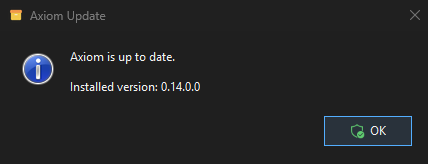

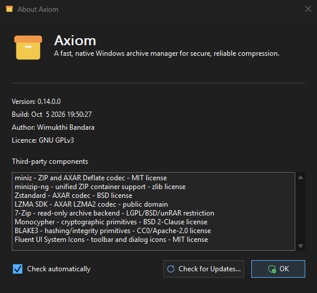

Choose **Help > About Axiom** (`F1`) to read the running executable's version,
build timestamp, author, license, and scrollable third-party component list.
**Check automatically** controls the same startup check as Settings > Updates.
**Check for Updates...** starts a manual check; **OK** closes About.

Choose **Help > Check for updates** (`Ctrl+Alt+Shift+U`) to check directly. The
result can report that you are up to date, an error checking the feed, or a
newer version. Startup checks stay quiet when nothing needs attention.

For a newer version, accept **Download and install it now?** to download its
installer. A second prompt asks whether to run the downloaded installer. Decline
it to leave the installer downloaded without launching it. Axiom checks the
installer against the release's published digest, verifies it again before
launch, and reports verification or launch failures.

If an archive operation is active when the download finishes, the message shows
the installer path and asks you to finish or cancel the operation first. On an
approved successful launch, Windows asks for administrator rights and Axiom
closes. Follow the Setup wizard to finish the update. For the updater's trust
model and remaining limitations, see [SECURITY.md](SECURITY.md).

## Using file pickers and confirmation dialogs

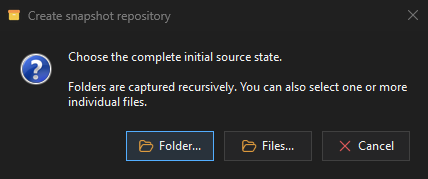

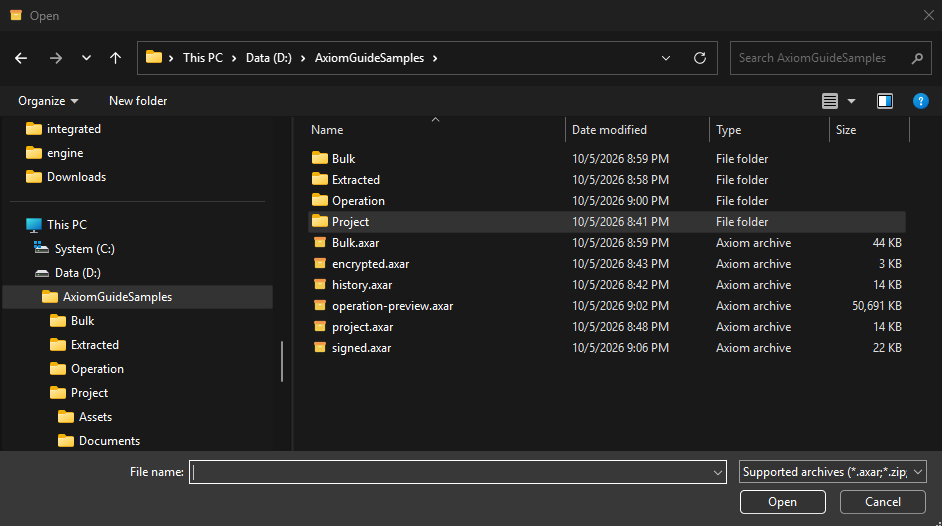

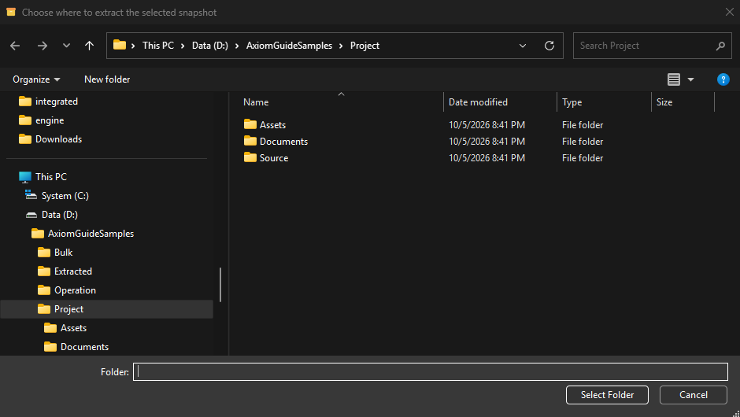

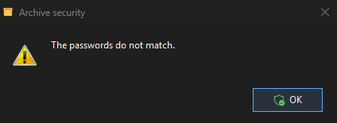

Axiom uses Windows dialogs to select source files/folders, open an archive, save
archives or streams, select signing keys, choose extraction destinations, and
export benchmark CSV. Read the dialog title and file-type filter before
confirming. A multi-file picker accepts several inputs; a folder picker selects
one source root or destination. **Cancel** stops that part of the workflow.

When no suitable filesystem selection is available for Add or snapshot capture,
the source-choice prompt offers **Folder**, **Files**, and **Cancel**. Selecting
Folder includes its descendants. The following options dialog lets you review
the output before an archive operation starts.

Other message dialogs explain validation problems, collisions, unsupported
commands, success, warnings, or failure. Yes/No confirmations are used for
deletion, overwriting, repair, repack, locking, SFX conversion, and cleanup.
Read the operation and path in the message before choosing Yes. An invalid input
keeps its dialog open so you can correct it.

### Installing, updating, repairing, or removing Axiom

Run `AxiomSetup-<version>-win-x64.exe` for a normal install. Setup shows its
license and installation choices, offers an optional desktop shortcut, and can
launch Axiom when finished. When it detects an existing installation, the
maintenance page offers Update for an older version, Repair/reinstall for the
same version, or Remove. It refuses to install over a newer version. Removal
starts the existing uninstaller. See [INSTALLER.md](INSTALLER.md) for the
complete setup behavior and installation layout.

## How it looks

Light and dark detection, High Contrast handling, native title bars, and
standard control theming come from the shared `Wimukthi.Win32Theme` framework.
Axiom layers its own work on top:

- Dark title bars, menus, dialogs, list views, progress controls, combo boxes,
  and message boxes.
- Fonts, icons, spacing, and dialog layout that rescale per monitor, so moving
  the window to a different display redraws it correctly.
- Hand-drawn controls wherever the standard Windows ones don't dark-theme
  properly.
- One set of command identifiers shared by the menus, toolbar, shortcuts, and
  context menus, so a command behaves the same however you reach it.

## Keyboard shortcuts

Every one of these can be rebound on the **Settings > Shortcuts** page. The
defaults:

| Action | Shortcut |
|---|---|
| Open archive | `Ctrl+O` |
| Open selected item | `Enter` while the file list is focused |
| Add to archive | `Ctrl+N` |
| Extract | `Ctrl+E` |
| Test archive | `Ctrl+T` |
| Update / Freshen / Synchronize | `Ctrl+U` / `Ctrl+Shift+U` / `Ctrl+Alt+U` |
| Repack | `Ctrl+Shift+R` |
| Split / Join volumes | `Ctrl+Shift+S` / `Ctrl+J` |
| Edit comment | `Ctrl+M` |
| Lock archive | `Ctrl+Shift+L` |
| Recovery record | `Ctrl+Shift+Y` |
| Repair archive | `Ctrl+Shift+P` |
| Generate signing key | `Ctrl+Shift+K` |
| Sign / Verify | `Ctrl+Shift+G` / `Ctrl+Shift+V` |
| Create self-extracting archive | `Ctrl+Shift+X` |
| Compress / decompress a single file | `Ctrl+Alt+Z` / `Ctrl+Alt+X` |
| Information | `Alt+Enter` |
| Snapshot timeline | `Ctrl+Shift+T` |
| Find files | `Ctrl+F` |
| Benchmark | `Ctrl+B` |
| Delete Axiom temporary files | `Ctrl+Shift+Delete` |
| Settings | `Ctrl+,` |
| Select all / Delete | `Ctrl+A` / `Delete` |
| Copy / Paste | `Ctrl+C` / `Ctrl+V` |
| Rename / New folder | `F2` / `Ctrl+Shift+N` |
| Copy path / Copy CRC-32 | `Ctrl+Shift+C` / `Ctrl+Alt+C` |
| Back / Forward / Up | `Alt+Left` / `Alt+Right` / `Alt+Up` |
| Focus the address bar | `Ctrl+L` |
| Go to the typed address | `Enter` while the address field is focused |
| Focus the instant filter | `Ctrl+Shift+F` |
| Refresh | `F5` |
| Show or hide the tree pane | `F9` |
| Add / remove favorite | `Ctrl+D` / `Ctrl+Shift+D` |
| Check for updates | `Ctrl+Alt+Shift+U` |
| About Axiom | `F1` |
| Exit | `Alt+F4` |

## Starting Axiom from a command or from Explorer

`Axiom.exe` accepts a few startup commands. This is how the Explorer integration
drives it, and you can use them yourself:

```text
Axiom.exe <archive>              open that archive in the browser
Axiom.exe --add <path>...        open Add to archive for those paths
Axiom.exe --extract <archive>    start the extraction flow
Axiom.exe --test <archive>       start the test flow
```

If Explorer fires several `--add` calls at once because you selected many files,
they are merged into one dialog rather than opening several.

## Housekeeping

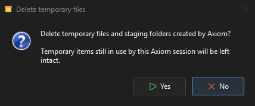

**Tools > Delete Axiom temporary files** clears Axiom's staging folder. It asks
for confirmation, skips temporary items still in use by this session, and runs
in the background. The result reports removed artifacts, reclaimed space, active
items left intact, and items that could not be removed. Wiping follows
**Settings > Security > Wipe temporary files extracted from encrypted
archives**; there is no separate wipe checkbox in the cleanup confirmation.

Startup cleanup uses the temporary-folder policy and age set under **Settings >
Paths**. It manages Axiom staging files rather than clearing every file in your
chosen temporary folder.
